# Nextou Customer App Complete Architecture

## 1. Purpose

This document is the complete architecture reference for the Nextou customer app. It covers the customer-facing Angular frontend, the Django backend APIs it consumes, the low-level service/action/repository boundaries, key data models, customer flows, endpoint contracts, runtime infrastructure, and source-code orientation.

This is intentionally broader than a simple HLD. It includes:

- High-level design (HLD)
- Low-level design (LLD)
- Frontend component and service architecture
- Backend URL, view, action, repository, serializer, and model architecture
- Customer app user flows
- Checkout and order lifecycle flows
- API map and ownership
- Data model map
- Runtime and deployment architecture
- Implementation notes and architectural observations

## 2. Repository Scope

| Area | Path | Purpose |
|---|---|---|
| Customer frontend | `frontend/projects/customer-app` | Angular standalone customer shopping app |
| Shared frontend | `frontend/projects/shared` | Shared services, components, pipes, models, guards, interceptors |
| Customer packages | `packages/customer-*` | Reusable customer domain logic and API client |
| Backend API | `backend` | Django REST API, models, actions, repositories, serializers, tasks, Channels |
| Runtime docs/output | `docs`, `output/pdf` | Architecture documentation and generated artifacts |

## 3. System HLD

The customer app is a standalone Angular app backed by a Django REST API. It uses two backend API styles:

- `/api/customer/*` for customer screen-composition payloads.
- Canonical domain APIs under `/api/auth/*`, `/api/products/*`, `/api/vendors/*`, `/api/orders/*`, `/api/notifications/*`, and `/api/invoices/*`.

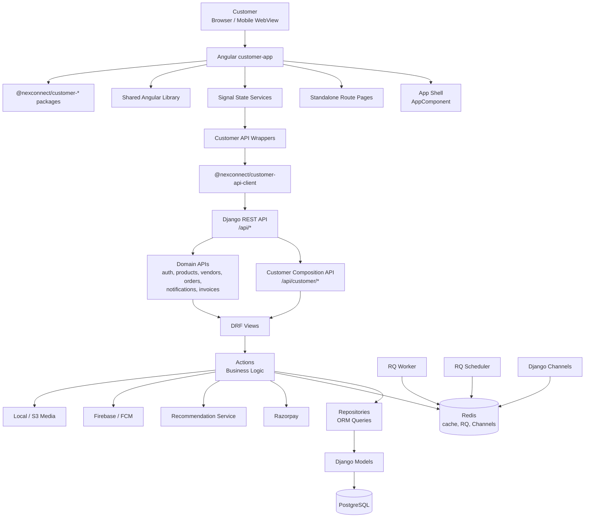
```mermaid
flowchart TB
  Customer["Customer<br/>Browser / Mobile WebView"] --> CustomerApp["Angular customer-app"]

  CustomerApp --> AppShell["App Shell<br/>AppComponent"]
  CustomerApp --> Pages["Standalone Route Pages"]
  CustomerApp --> State["Signal State Services"]
  CustomerApp --> Shared["Shared Angular Library"]
  CustomerApp --> Packages["@nexconnect/customer-* packages"]

  State --> ApiWrappers["Customer API Wrappers"]
  ApiWrappers --> ApiClient["@nexconnect/customer-api-client"]
  ApiClient --> Django["Django REST API<br/>/api/*"]

  Django --> CustomerAPI["Customer Composition API<br/>/api/customer/*"]
  Django --> DomainAPI["Domain APIs<br/>auth, products, vendors, orders,<br/>notifications, invoices"]

  CustomerAPI --> Views["DRF Views"]
  DomainAPI --> Views
  Views --> Actions["Actions<br/>Business Logic"]
  Actions --> Repos["Repositories<br/>ORM Queries"]
  Repos --> Models["Django Models"]
  Models --> DB[("PostgreSQL")]

  Actions --> Redis[("Redis<br/>cache, RQ, Channels")]
  Actions --> Razorpay["Razorpay"]
  Actions --> Reco["Recommendation Service"]
  Actions --> FCM["Firebase / FCM"]
  Actions --> Storage["Local / S3 Media"]

  Worker["RQ Worker"] --> Redis
  Scheduler["RQ Scheduler"] --> Redis
  Channels["Django Channels"] --> Redis
```

## 4. Frontend HLD

### 4.1 Bootstrap

Entry point:

- `frontend/projects/customer-app/src/main.ts`

Bootstrap responsibilities:

- Starts `AppComponent` with `bootstrapApplication`.
- Registers Angular Router with in-memory scroll restoration.
- Registers `HttpClient` with `authInterceptor` and `cacheInterceptor`.
- Provides `API_BASE_URL`.
- Provides `AUTH_PREFIX = customer`.
- Sets Google Maps runtime config from environment.
- Uses `/api` in development and `/sa/api` in production.

### 4.2 Route Architecture

Routes:

- `frontend/projects/customer-app/src/app/app.routes.ts`

| Route | Page | Purpose |
|---|---|---|
| `/` | Home | Customer landing/home commerce surface |
| `/location` | Location | Select map/current/saved location |
| `/explore` | Search | Browse/search stores, products, categories, offers |
| `/explore/:categoryId` | Search | Category-scoped browse |
| `/store/:id` | Store Detail | Store profile, products, category filters |
| `/product/:id` | Product Detail | Product detail and add-to-cart |
| `/cart` | Cart | Cart review and checkout entry |
| `/checkout` | Checkout | Address, slot, payment, review, place order |
| `/orders` | Orders | Order history |
| `/order-confirmed/:id` | Confirmation | Post-order confirmation |
| `/tracking/:id` | Tracking | Live-ish order tracking and receipt |
| `/order-finished/:id` | Finished | Delivered order completion and rating |
| `/account` | Profile | Account hub |
| `/addresses` | Addresses | Saved address CRUD |

Guarded pages:

- `order-confirmed/:id`
- `tracking/:id`
- `order-finished/:id`
- `order/:id/rating`

### 4.3 Frontend HLD Diagram

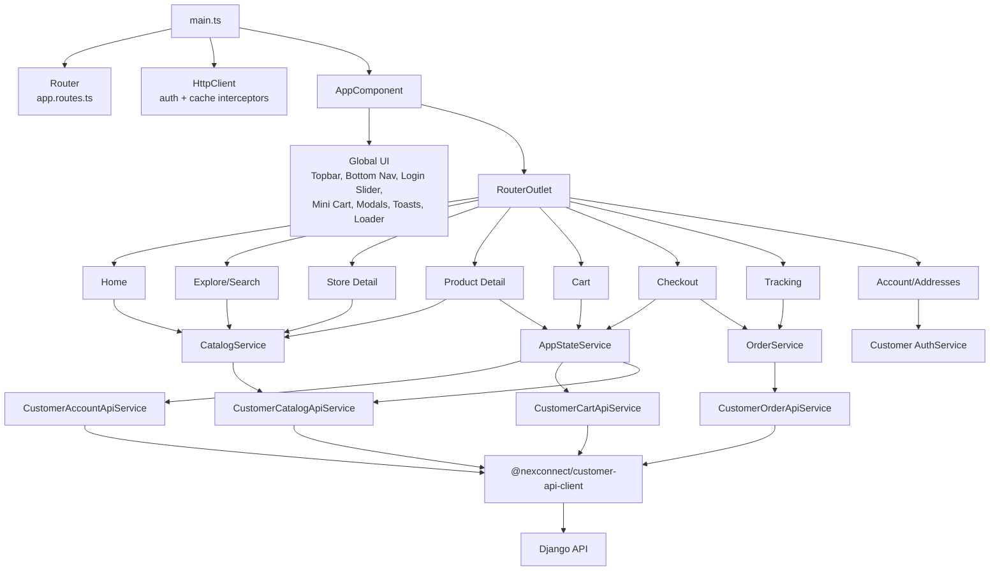
```mermaid
flowchart TB
  Main["main.ts"] --> Router["Router<br/>app.routes.ts"]
  Main --> HTTP["HttpClient<br/>auth + cache interceptors"]
  Main --> Shell["AppComponent"]

  Shell --> GlobalUI["Global UI<br/>Topbar, Bottom Nav, Login Slider,<br/>Mini Cart, Modals, Toasts, Loader"]
  Shell --> Outlet["RouterOutlet"]

  Outlet --> Home["Home"]
  Outlet --> Explore["Explore/Search"]
  Outlet --> Store["Store Detail"]
  Outlet --> Product["Product Detail"]
  Outlet --> Cart["Cart"]
  Outlet --> Checkout["Checkout"]
  Outlet --> Tracking["Tracking"]
  Outlet --> Account["Account/Addresses"]

  Home --> Catalog["CatalogService"]
  Explore --> Catalog
  Store --> Catalog
  Product --> Catalog
  Product --> AppState["AppStateService"]
  Cart --> AppState
  Checkout --> AppState
  Checkout --> Orders["OrderService"]
  Tracking --> Orders
  Account --> Auth["Customer AuthService"]

  AppState --> AccountAPI["CustomerAccountApiService"]
  AppState --> CartAPI["CustomerCartApiService"]
  AppState --> CatalogAPI["CustomerCatalogApiService"]
  Orders --> OrderAPI["CustomerOrderApiService"]
  Catalog --> CatalogAPI

  AccountAPI --> Client["@nexconnect/customer-api-client"]
  CartAPI --> Client
  CatalogAPI --> Client
  OrderAPI --> Client
  Client --> Backend["Django API"]
```

## 5. Frontend LLD

### 5.1 AppComponent LLD

File:

- `frontend/projects/customer-app/src/app/app.component.ts`

Inputs and dependencies:

- `Router`
- `AppStateService`
- `UiService`
- `CatalogService`
- `OrderService`
- `CustomerAppStartupService`

Responsibilities:

- Maintains `currentUrl`.
- Derives route-sensitive UI visibility.
- Shows/hides mobile topbar.
- Shows/hides mobile sticky cart assist.
- Shows active order card only where it will not conflict with checkout/order/account surfaces.
- Tracks route transitions with `NavigationStart`, `NavigationEnd`, `NavigationCancel`, `NavigationError`.
- Computes `loading` from route loading plus current page data loading.
- Mounts all global overlays and shared UI shells.

Important computed state:

- `isHomeRoute`
- `showMobileTopbar`
- `showCartAssist`
- `hasUsableLocation`
- `showActiveOrderCard`
- `hasBlockingOverlay`

### 5.2 AppStateService LLD

File:

- `frontend/projects/customer-app/src/app/services/app-state.service.ts`

AppStateService is the customer aggregate service. It owns the critical client state and orchestrates cart, checkout, address, payment, serviceability, location, and active order behavior.

#### Signals

| Signal | Meaning |
|---|---|
| `location` | Display location label |
| `cart` | Current customer or guest cart items |
| `addresses` | Saved customer addresses |
| `paymentMethods` | Enabled/available payment methods |
| `activeAddress` | Selected delivery address |
| `selectedPaymentMethod` | Selected payment method id |
| `coupon` | Applied coupon code |
| `couponDiscount` | Applied coupon discount value |
| `toast` | Customer app toast state |
| `miniCartOpen` | Mini-cart open state |
| `lastAddedProductId` | Product id used for add-to-cart feedback |
| `checkoutSubmitting` | Checkout submission flag |
| `lastCheckoutError` | Last checkout error |
| `deliveryFeePreview` | Delivery quote preview payload |
| `checkoutPriceBreakup` | Backend checkout price breakup |
| `requiresFarDeliveryConfirmation` | Whether far delivery confirmation is needed |
| `cartLoaded` | Whether cart loading completed |
| `serviceability` | Current location serviceability |
| `serviceabilityLoading` | Serviceability loading flag |
| `activeOrder` | Current active order summary |

#### Computed State

| Computed | Purpose |
|---|---|
| `itemCount` | Total cart quantity |
| `subtotal` | Cart subtotal |
| `mrpTotal` | MRP total |
| `discount` | Product + coupon savings |
| `deliveryFeeKnown` | Whether fee preview is ready for selected address |
| `deliveryFee` | Current delivery fee |
| `freeDeliveryThreshold` | Free delivery threshold |
| `deliveryPromotion` | Free delivery progress model |
| `deliveryFeeLabel` | Display label |
| `cartStore` | Resolved store/vendor for the cart |
| `cartMinimumOrderAmount` | Store minimum order |
| `cartMinimumOrderRemaining` | Remaining amount for minimum order |
| `hasMixedStoreItems` | Client-side mixed-store detection |
| `cartCheckoutBlockReason` | Human-readable checkout blocker |
| `canCheckoutCart` | Whether cart can proceed |
| `platformFee` | Platform fee from preview |
| `handlingFee` | Packaging/handling fee |
| `smallCartFee` | Small cart fee |
| `taxAmount` | Tax amount |
| `surgeFee` | Surge fee |
| `total` | Final payable amount |

#### Major Methods

| Method | Responsibility |
|---|---|
| `bootstrapAuthenticatedState` | Load profile, merge guest cart, load cart/addresses/payments/active order |
| `refreshCatalogForLocation` | Refresh home, categories, stores, serviceability by location |
| `addToCart` | Add guest/backend item with store-open and conflict handling |
| `handleAddToCartError` | Resolve cart store conflict with confirmation dialog |
| `updateQuantity` | Update guest/backend item quantity |
| `removeItem` | Remove guest/backend item |
| `clearCart` | Clear guest/backend cart |
| `applyCoupon` | Validate and apply coupon |
| `selectMapLocation` | Persist manual map location and refresh catalog/serviceability |
| `useCurrentLocation` | Resolve current location and refresh catalog/serviceability |
| `loadCart` | Load backend cart or guest cart |
| `loadAddresses` | Load and select saved addresses |
| `createAddress` | Create customer address |
| `updateAddress` | Update customer address |
| `deleteAddress` | Delete customer address |
| `selectAddress` | Select active address and mark default best-effort |
| `loadPaymentMethods` | Load enabled payment methods |
| `checkServiceability` | Query location serviceability |
| `loadActiveOrder` | Load active order summary |
| `selectPayment` | Select payment method |
| `placeOrder` | Create checkout payload and run COD/Razorpay order flow |
| `placeRazorpayOrder` | Initiate Razorpay, open modal, create order with proof |
| `getCheckoutPreview` | Fetch checkout preview for UI |
| `refreshCheckoutPreview` | Auto-refresh price breakup |

### 5.3 CatalogService LLD

File:

- `frontend/projects/customer-app/src/app/services/catalog.service.ts`

Owned state:

- Categories
- Stores
- Products
- Buy-again products
- Recommended products
- Store products by store id
- Banners
- Coupons
- Home hero
- Home sections
- Loading request counters
- Store pagination cursor
- Product detail request cache
- Store product request cache

Important methods:

| Method | Responsibility |
|---|---|
| `loadHome` | Fetch customer home composition and populate multiple signals |
| `loadCategories` | Fetch visible categories |
| `loadStores` | Discover stores using location/search/category plan |
| `loadMoreStores` | Paginate store list |
| `loadBestDealRecommendations` | Fetch vendor recommendations |
| `loadProducts` | Fetch product list |
| `loadExplore` | Fetch explore composition payload |
| `loadStoreProducts` | Fetch vendor detail/products |
| `ensureProductLoaded` | Lazy load product detail |
| `ensureStoreProductsLoaded` | Lazy load store products |
| `productsByStore` | Read products for store |
| `productsByCategory` | Read products for category |
| `search` | Client-side search over loaded data |
| `refreshSearch` | Fetch server-side products/vendors for query |
| `mapProduct`, `mapStore`, `mapCategory` | Normalize backend models into UI models |

### 5.4 OrderService LLD

File:

- `frontend/projects/customer-app/src/app/services/order.service.ts`

Responsibilities:

- Load customer orders.
- Cache individual order responses.
- Resolve an order by id from cache or API.
- Place order through `AppStateService`.
- Reorder an existing order into cart.
- Cancel order.
- Submit vendor/delivery rating.

### 5.5 UiService LLD

File:

- `frontend/projects/customer-app/src/app/services/ui.service.ts`

Responsibilities:

- Overlay and menu state.
- Confirm dialog orchestration.
- Mobile sidebar state.
- Login slider state.
- Location and filter modal state.
- Edit modal state.

### 5.6 API Client LLD

File:

- `packages/customer-api-client/src/index.ts`

Responsibilities:

- Defines `CUSTOMER_API_ENDPOINTS`.
- Joins base URL and path.
- Builds query strings.
- Adds JSON headers.
- Adds Bearer access token.
- Refreshes access token on 401/auth errors.
- Clears token state if refresh fails.
- Groups API methods by domain:
  - `auth`
  - `account`
  - `catalog`
  - `cart`
  - `checkout`
  - `orders`
  - `notifications`
  - `wallet`
  - `support`

Adapters used by Angular:

| Adapter | Purpose |
|---|---|
| `AngularHttpAdapter` | Uses Angular HttpClient as transport |
| `BrowserTokenStorageAdapter` | Reads/writes customer tokens in browser storage |
| `BrowserPaymentAdapter` | Loads Razorpay script and opens checkout modal |

### 5.7 Frontend Page LLD

| Page | Main Dependencies | Main Behavior |
|---|---|---|
| Home | `CatalogService`, `AppStateService`, `UiService`, `CustomerContentConfigService` | Shows home hero, categories, serviceable stores, product rails, promotions, quick actions |
| Explore/Search | `CatalogService`, `AppStateService`, `UiService`, route params | Search, category browse, tabs, filters, recent searches, store/product/category results |
| Store Detail | `CatalogService`, `AppStateService` | Loads store products, displays store availability and products |
| Product Detail | `CatalogService`, `AppStateService` | Ensures product detail, shows product data, add-to-cart |
| Cart | `AppStateService`, `CatalogService` | Shows cart items, quantity updates, coupon, checkout blockers |
| Checkout | `AppStateService`, `OrderService`, `CustomerCartApiService`, `UiService` | Address validation, address previews, slot selection, payment, COD confirmation, order placement |
| Orders | `OrderService` | Loads and displays order history |
| Order Confirmed | `CustomerApiClientService`, route params | Loads confirmation payload |
| Tracking | `OrderService`, `CustomerOrderApiService`, `GoogleMapsService` | Polls tracking, renders timeline/map, downloads receipt |
| Order Finished | `OrderService` | Delivered order completion and rating |
| Account/Profile | `AuthService`, `AppStateService`, `UiService` | Profile, account surfaces, address/payment links |
| Addresses | `AppStateService`, `UiService` | Saved address CRUD |

## 6. Backend HLD

### 6.1 Root Routing

File:

- `backend/backend/routes/__init__.py`

Mounted routes:

| Prefix | App/Area |
|---|---|
| `/api/auth/` | Accounts |
| `/api/customer/` | Customer composition |
| `/api/vendor/` | Vendor alias |
| `/api/vendors/` | Vendors |
| `/api/products/` | Products |
| `/api/orders/` | Orders |
| `/api/delivery/` | Delivery |
| `/api/notifications/` | Notifications |
| `/api/support/` | Support |
| `/api/invoices/` | Invoices |
| `/api/files/` | Files |
| `/api/media/<path>/` | Media |
| `/api/admin/` | Admin |
| `/api/schema/`, `/api/docs/`, `/api/redoc/` | OpenAPI |

### 6.2 Backend Layering

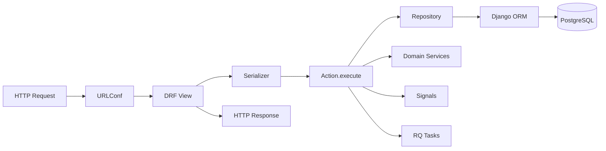
```mermaid
flowchart LR
  Request["HTTP Request"] --> Urls["URLConf"]
  Urls --> View["DRF View"]
  View --> Serializer["Serializer"]
  Serializer --> Action["Action.execute"]
  Action --> Repository["Repository"]
  Repository --> ORM["Django ORM"]
  ORM --> DB[("PostgreSQL")]
  Action --> Services["Domain Services"]
  Action --> Signals["Signals"]
  Action --> Tasks["RQ Tasks"]
  View --> Response["HTTP Response"]
```

Layer responsibilities:

| Layer | Responsibility |
|---|---|
| URLs | Public route mapping |
| Views | HTTP parsing, auth/permission, serializer validation, response status |
| Serializers | Request validation and response transformation |
| Actions | Business workflows and domain rules |
| Repositories | ORM query construction and reuse |
| Models | Durable state |
| Signals | Cross-app domain events |
| Tasks | Async or deferred processing |
| Services | External integration or reusable domain utilities |

## 7. Backend LLD

### 7.1 Customer Composition LLD

Routes:

- `backend/backend/routes/customer.py`

Views:

- `backend/backend/views/customer_views.py`

Actions:

- `GetCustomerFlowHomeAction`
- `GetCustomerExploreAction`
- `GetCustomerBuyAgainAction`
- `GetCustomerCartSuggestionsAction`
- `GetCustomerBestCouponAction`
- `GetCustomerCheckoutSlotsAction`
- `GetCustomerActiveOrderAction`
- `GetCustomerOrderConfirmationAction`

Repository:

- `CustomerFlowRepository`

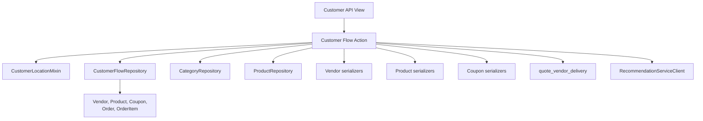
```mermaid
flowchart TB
  CustomerView["Customer API View"] --> Action["Customer Flow Action"]
  Action --> LocationMixin["CustomerLocationMixin"]
  Action --> CustomerRepo["CustomerFlowRepository"]
  Action --> CategoryRepo["CategoryRepository"]
  Action --> ProductRepo["ProductRepository"]
  Action --> VendorSerializer["Vendor serializers"]
  Action --> ProductSerializer["Product serializers"]
  Action --> CouponSerializer["Coupon serializers"]
  Action --> Quote["quote_vendor_delivery"]
  Action --> Recommendation["RecommendationServiceClient"]
  CustomerRepo --> Models["Vendor, Product, Coupon,<br/>Order, OrderItem"]
```

Customer composition endpoint ownership:

| Endpoint | View | Action | Notes |
|---|---|---|---|
| `/api/customer/home/` | `CustomerHomeView` | `GetCustomerFlowHomeAction` | Aggregates home payload |
| `/api/customer/location/serviceability/` | `CustomerServiceabilityView` | `GetCustomerFlowHomeAction.serviceability_payload` | Uses selected location |
| `/api/customer/explore/` | `CustomerExploreView` | `GetCustomerExploreAction` | Search/browse composition |
| `/api/customer/buy-again/` | `CustomerBuyAgainView` | `GetCustomerBuyAgainAction` | Authenticated history |
| `/api/customer/cart/suggestions/` | `CustomerCartSuggestionsView` | `GetCustomerCartSuggestionsAction` | Same-store add-ons and replacements |
| `/api/customer/cart/apply-best-coupon/` | `CustomerBestCouponView` | `GetCustomerBestCouponAction` | Basket coupon optimization |
| `/api/customer/checkout/slots/` | `CustomerCheckoutSlotsView` | `GetCustomerCheckoutSlotsAction` | Scheduled slot options |
| `/api/customer/orders/active/` | `CustomerActiveOrderView` | `GetCustomerActiveOrderAction` | Active order card |
| `/api/customer/orders/<pk>/confirmation/` | `CustomerOrderConfirmationView` | `GetCustomerOrderConfirmationAction` | Confirmation page payload |

### 7.2 Product and Store Discovery LLD

Product views:

- `backend/products/views/categories.py`
- `backend/products/views/inventory.py`
- `backend/products/views/search_views.py`
- `backend/products/views/wishlist_views.py`

Vendor views:

- `backend/vendors/views/discovery_views.py`
- `backend/vendors/views/detail_public_views.py`
- `backend/vendors/views/recommendation_views.py`

Discovery rules:

- Categories are filtered by customer visibility and available products.
- Product list filters by search, category, vendor, price, and availability.
- Product search by location groups matching products by store.
- Vendor discovery supports browse, nearby, manual far, and global item modes.
- Store cards can include delivery quote information.
- Stores are usually filtered to approved, open, accepting orders, and serviceable.
- Recommendation service ranking is optional and fail-soft.

### 7.3 Cart LLD

Files:

- `backend/orders/views/cart_views.py`
- `backend/orders/data/cart_repo.py`
- `backend/orders/serializers/cart_serializers.py`

Cart endpoints:

| Endpoint | Method | Behavior |
|---|---|---|
| `/api/orders/cart/` | GET | Get or create authenticated cart |
| `/api/orders/cart/add/` | POST | Add product to cart |
| `/api/orders/cart/replace/` | POST | Clear cart and add product |
| `/api/orders/cart/items/<pk>/` | PATCH | Update item quantity |
| `/api/orders/cart/items/<pk>/` | DELETE | Remove item |
| `/api/orders/cart/clear/` | DELETE | Clear cart |

Cart invariants:

- User must be authenticated.
- Product must exist and be customer-visible.
- Cart is single-vendor.
- Quantity cannot exceed stock.
- Replace cart is atomic.

### 7.4 Checkout Preview LLD

Files:

- `backend/orders/views/checkout_preview_views.py`
- `backend/orders/actions/checkout.py`

Checkout preview responsibilities:

- Validate active user.
- Validate delivery address ownership and completeness.
- Validate payment method against platform settings.
- Validate COD-UPI confirmation if required.
- Load cart items.
- Enforce single-vendor cart.
- Enforce vendor minimum order.
- Validate vendor availability, holiday, and schedule slot.
- Validate coupon.
- Quote delivery.
- Require far-delivery confirmation when needed.
- Calculate:
  - item subtotal
  - product discount
  - coupon discount
  - delivery fee
  - platform fee
  - packaging fee
  - small cart fee
  - surge fee
  - tax
  - wallet discount
  - loyalty discount
  - final payable

### 7.5 Order Creation LLD

Files:

- `backend/orders/views/create_order_views.py`
- `backend/orders/actions/ordering/create_orders.py`

Order creation is transactional.

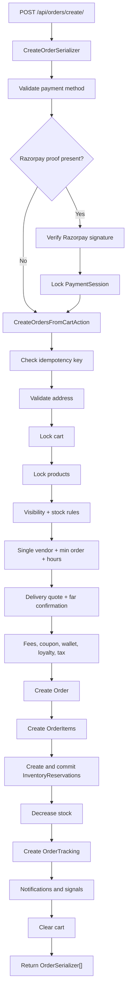
```mermaid
flowchart TD
  Start["POST /api/orders/create/"] --> Serializer["CreateOrderSerializer"]
  Serializer --> Payment["Validate payment method"]
  Payment --> Razorpay{"Razorpay proof present?"}
  Razorpay -->|Yes| Signature["Verify Razorpay signature"]
  Signature --> Session["Lock PaymentSession"]
  Razorpay -->|No| Action["CreateOrdersFromCartAction"]
  Session --> Action
  Action --> Idempotency["Check idempotency key"]
  Idempotency --> Address["Validate address"]
  Address --> Cart["Lock cart"]
  Cart --> Products["Lock products"]
  Products --> ProductRules["Visibility + stock rules"]
  ProductRules --> VendorRules["Single vendor + min order + hours"]
  VendorRules --> Delivery["Delivery quote + far confirmation"]
  Delivery --> Pricing["Fees, coupon, wallet, loyalty, tax"]
  Pricing --> Order["Create Order"]
  Order --> Items["Create OrderItems"]
  Items --> Inventory["Create and commit InventoryReservations"]
  Inventory --> Stock["Decrease stock"]
  Stock --> Tracking["Create OrderTracking"]
  Tracking --> Notifications["Notifications and signals"]
  Notifications --> ClearCart["Clear cart"]
  ClearCart --> Response["Return OrderSerializer[]"]
```

### 7.6 Payment LLD

Files:

- `backend/orders/views/payment_views.py`
- `backend/orders/services/razorpay_service.py`
- `backend/orders/actions/payment_actions.py`

Payment methods:

- Configured by `PlatformSetting.normalized_payment_methods`.
- COD is displayed to customers as UPI at Delivery.
- Online payment methods use Razorpay.

Razorpay checkout flow:

1. Frontend calls `/api/orders/initiate-checkout-payment/`.
2. Backend calculates authoritative checkout preview for Razorpay.
3. Backend creates Razorpay order.
4. Backend stores `PaymentSession`.
5. Frontend opens Razorpay modal.
6. Frontend sends payment proof to `/api/orders/create/`.
7. Backend verifies signature and locks session.
8. Backend creates order and attaches paid session.

### 7.7 Order Read, Tracking, Cancel, Rating LLD

Files:

- `backend/orders/views/order_read_views.py`
- `backend/orders/views/order_rating_views.py`
- `backend/orders/views/reorder_views.py`
- `backend/orders/actions/ordering/cancel_order.py`

Responsibilities:

- List customer orders.
- Add summary metadata to list response.
- Retrieve customer-owned order detail.
- Return order tracking events.
- Cancel allowed orders.
- Reorder previous order into cart.
- Submit vendor and delivery partner rating.
- Tip delivery partner on delivered orders.

### 7.8 Notifications and Invoices LLD

Notifications:

- `backend/notifications/views/user_views.py`
- `backend/notifications/views/device_token_views.py`
- `backend/notifications/actions/notification_actions.py`
- `backend/notifications/actions/device_token_actions.py`

Invoices:

- `backend/invoices/views/generate_views.py`
- `backend/invoices/views/download_views.py`
- `backend/invoices/actions/invoice_actions.py`
- `backend/invoices/services/pdf_service.py`

## 8. Data Model Map

### 8.1 Customer Identity and Account

| Model | App | Purpose |
|---|---|---|
| `User` | accounts | Custom user with role |
| `Address` | accounts | Customer delivery addresses |
| `MobileOTP` | accounts | Mobile/email OTP auth |
| `Wallet` | accounts | Wallet balance |
| `WalletTransaction` | accounts | Wallet ledger |
| `LoyaltyAccount` | accounts | Loyalty balance |
| `LoyaltyTransaction` | accounts | Loyalty ledger |
| `Referral` | accounts | Referral tracking |

### 8.2 Catalog and Store

| Model | App | Purpose |
|---|---|---|
| `Category` | products | Product category/subcategory |
| `CatalogProduct` | products | Parent catalog product |
| `CatalogProductImage` | products | Parent catalog product images |
| `Product` | products | Vendor sellable product |
| `ProductImage` | products | Vendor product images |
| `ProductReview` | products | Product review |
| `Wishlist` | products | Customer wishlist |
| `Vendor` | vendors | Store/vendor profile |
| `VendorReview` | vendors | Store review |
| `VendorHoliday` | vendors | Store holiday schedule |

### 8.3 Cart, Checkout, Order

| Model | App | Purpose |
|---|---|---|
| `Cart` | orders | Customer cart |
| `CartItem` | orders | Cart line item |
| `Coupon` | orders | Coupon definition |
| `CouponUsage` | orders | Coupon redemption ledger |
| `PlatformSetting` | orders | Fees, payment methods, policy |
| `Order` | orders | Customer order |
| `OrderItem` | orders | Order line snapshot |
| `OrderTracking` | orders | Timeline event |
| `PaymentSession` | orders | Pre-order Razorpay payment session |
| `InventoryReservation` | orders | Inventory reservation for order creation |
| `OrderRating` | orders | Customer rating for delivered order |
| `OrderIssue` | orders | Customer issue |
| `IssueMessage` | orders | Issue chat message |
| `OrderIssueAttachment` | orders | Issue attachment |

### 8.4 Delivery, Notification, Invoice

| Model | App | Purpose |
|---|---|---|
| `DeliveryPartner` | delivery | Delivery partner profile |
| `DeliveryAssignment` | delivery | Delivery search/assignment |
| `DeliveryEarning` | delivery | Delivery earnings |
| `DeliveryReview` | delivery | Customer review of delivery |
| `Notification` | notifications | In-app notification |
| `DeviceToken` | notifications | Push token |
| `Invoice` | invoices | Generated invoice metadata/file |

## 9. Customer Flow Architecture

### 9.1 Startup Flow

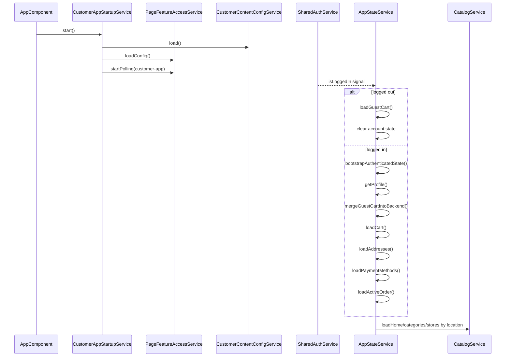
```mermaid
sequenceDiagram
  participant App as AppComponent
  participant Startup as CustomerAppStartupService
  participant Features as PageFeatureAccessService
  participant Content as CustomerContentConfigService
  participant Auth as SharedAuthService
  participant State as AppStateService
  participant Catalog as CatalogService

  App->>Startup: start()
  Startup->>Content: load()
  Startup->>Features: loadConfig()
  Startup->>Features: startPolling(customer-app)
  Auth-->>State: isLoggedIn signal
  alt logged out
    State->>State: loadGuestCart()
    State->>State: clear account state
  else logged in
    State->>State: bootstrapAuthenticatedState()
    State->>State: getProfile()
    State->>State: mergeGuestCartIntoBackend()
    State->>State: loadCart()
    State->>State: loadAddresses()
    State->>State: loadPaymentMethods()
    State->>State: loadActiveOrder()
  end
  State->>Catalog: loadHome/categories/stores by location
```

### 9.2 Location and Serviceability Flow

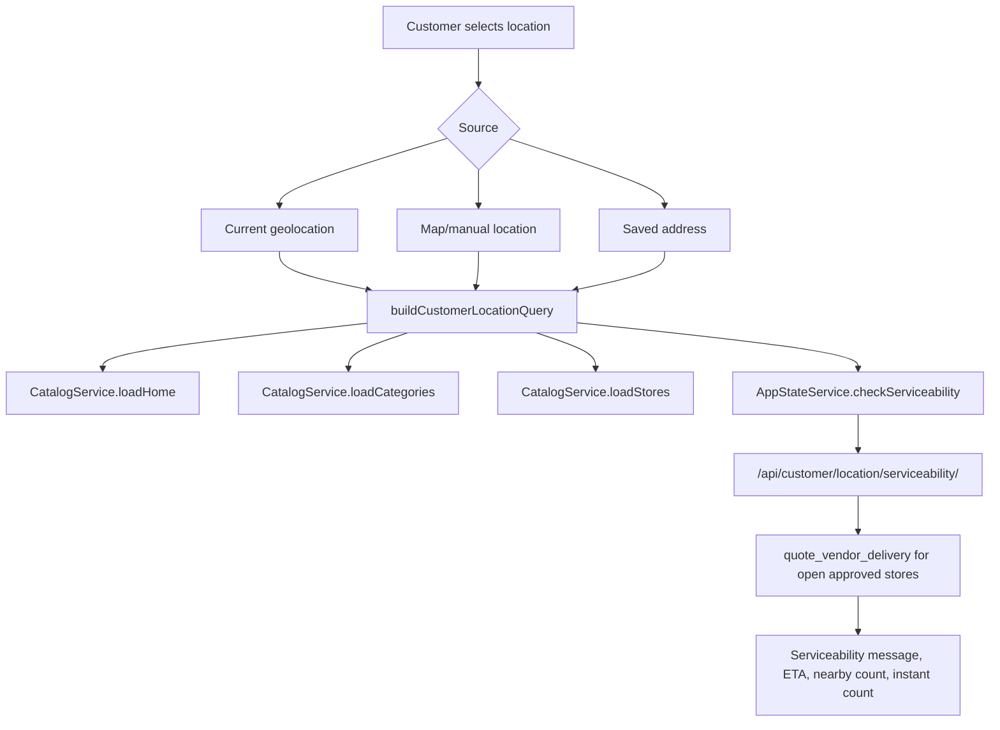
```mermaid
flowchart TD
  User["Customer selects location"] --> Source{"Source"}
  Source --> Current["Current geolocation"]
  Source --> Manual["Map/manual location"]
  Source --> Saved["Saved address"]
  Current --> Query["buildCustomerLocationQuery"]
  Manual --> Query
  Saved --> Query
  Query --> Home["CatalogService.loadHome"]
  Query --> Categories["CatalogService.loadCategories"]
  Query --> Stores["CatalogService.loadStores"]
  Query --> Serviceability["AppStateService.checkServiceability"]
  Serviceability --> Backend["/api/customer/location/serviceability/"]
  Backend --> Quote["quote_vendor_delivery for open approved stores"]
  Quote --> UI["Serviceability message, ETA, nearby count, instant count"]
```

### 9.3 Home Flow

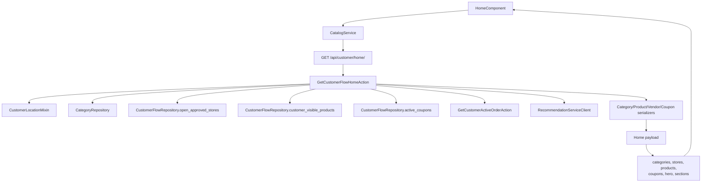
```mermaid
flowchart TD
  HomePage["HomeComponent"] --> Catalog["CatalogService"]
  Catalog --> HomeAPI["GET /api/customer/home/"]
  HomeAPI --> HomeAction["GetCustomerFlowHomeAction"]
  HomeAction --> Location["CustomerLocationMixin"]
  HomeAction --> Categories["CategoryRepository"]
  HomeAction --> Stores["CustomerFlowRepository.open_approved_stores"]
  HomeAction --> Products["CustomerFlowRepository.customer_visible_products"]
  HomeAction --> Coupons["CustomerFlowRepository.active_coupons"]
  HomeAction --> ActiveOrder["GetCustomerActiveOrderAction"]
  HomeAction --> Reco["RecommendationServiceClient"]
  HomeAction --> Serializers["Category/Product/Vendor/Coupon serializers"]
  Serializers --> Payload["Home payload"]
  Payload --> CatalogSignals["categories, stores, products,<br/>coupons, hero, sections"]
  CatalogSignals --> HomePage
```

### 9.4 Explore and Search Flow

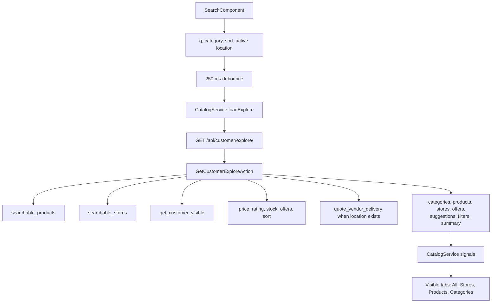
```mermaid
flowchart TD
  Explore["SearchComponent"] --> RouteParams["q, category, sort, active location"]
  RouteParams --> Debounce["250 ms debounce"]
  Debounce --> LoadExplore["CatalogService.loadExplore"]
  LoadExplore --> API["GET /api/customer/explore/"]
  API --> Action["GetCustomerExploreAction"]
  Action --> ProductQuery["searchable_products"]
  Action --> StoreQuery["searchable_stores"]
  Action --> CategoryQuery["get_customer_visible"]
  Action --> Filters["price, rating, stock, offers, sort"]
  Action --> Quote["quote_vendor_delivery when location exists"]
  Action --> Response["categories, products, stores, offers,<br/>suggestions, filters, summary"]
  Response --> Catalog["CatalogService signals"]
  Catalog --> Results["Visible tabs: All, Stores, Products, Categories"]
```

### 9.5 Store Detail Flow

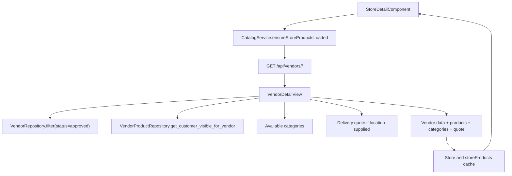
```mermaid
flowchart TD
  StorePage["StoreDetailComponent"] --> Catalog["CatalogService.ensureStoreProductsLoaded"]
  Catalog --> API["GET /api/vendors/<id>/"]
  API --> View["VendorDetailView"]
  View --> VendorRepo["VendorRepository.filter(status=approved)"]
  View --> ProductRepo["VendorProductRepository.get_customer_visible_for_vendor"]
  View --> Categories["Available categories"]
  View --> Quote["Delivery quote if location supplied"]
  View --> Payload["Vendor data + products + categories + quote"]
  Payload --> CatalogState["Store and storeProducts cache"]
  CatalogState --> StorePage
```

### 9.6 Product Detail and Add-to-Cart Flow

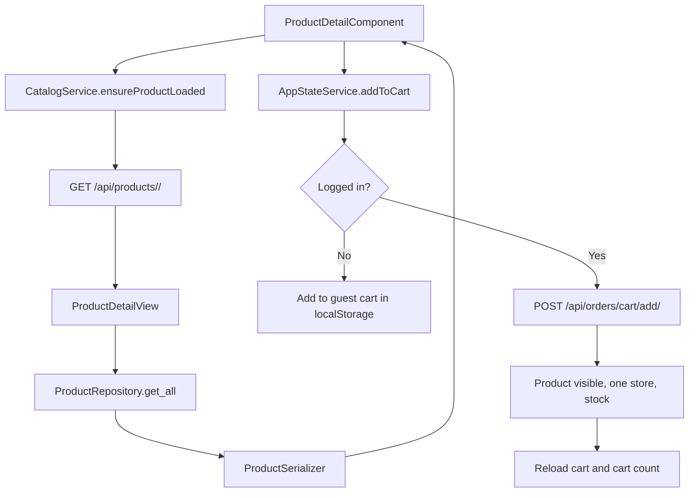
```mermaid
flowchart TD
  ProductPage["ProductDetailComponent"] --> Ensure["CatalogService.ensureProductLoaded"]
  Ensure --> ProductAPI["GET /api/products/<id>/"]
  ProductAPI --> ProductDetail["ProductDetailView"]
  ProductDetail --> ProductRepo["ProductRepository.get_all"]
  ProductRepo --> ProductPayload["ProductSerializer"]
  ProductPayload --> ProductPage
  ProductPage --> Add["AppStateService.addToCart"]
  Add --> Auth{"Logged in?"}
  Auth -->|No| Guest["Add to guest cart in localStorage"]
  Auth -->|Yes| CartAPI["POST /api/orders/cart/add/"]
  CartAPI --> CartRules["Product visible, one store, stock"]
  CartRules --> CartState["Reload cart and cart count"]
```

### 9.7 Guest Cart Merge Flow

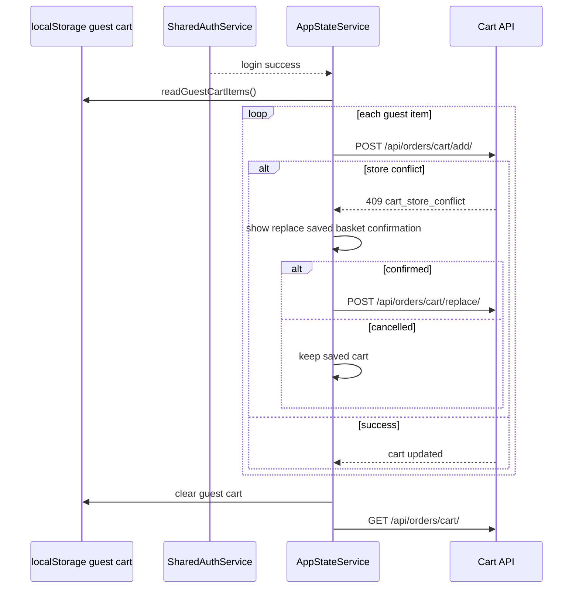
```mermaid
sequenceDiagram
  participant Guest as localStorage guest cart
  participant Auth as SharedAuthService
  participant State as AppStateService
  participant API as Cart API

  Auth-->>State: login success
  State->>Guest: readGuestCartItems()
  loop each guest item
    State->>API: POST /api/orders/cart/add/
    alt store conflict
      API-->>State: 409 cart_store_conflict
      State->>State: show replace saved basket confirmation
      alt confirmed
        State->>API: POST /api/orders/cart/replace/
      else cancelled
        State->>State: keep saved cart
      end
    else success
      API-->>State: cart updated
    end
  end
  State->>Guest: clear guest cart
  State->>API: GET /api/orders/cart/
```

### 9.8 Cart Flow

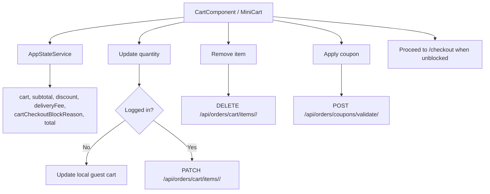
```mermaid
flowchart TD
  CartPage["CartComponent / MiniCart"] --> State["AppStateService"]
  State --> CartSignals["cart, subtotal, discount, deliveryFee,<br/>cartCheckoutBlockReason, total"]
  CartPage --> Qty["Update quantity"]
  Qty --> Auth{"Logged in?"}
  Auth -->|No| GuestUpdate["Update local guest cart"]
  Auth -->|Yes| BackendUpdate["PATCH /api/orders/cart/items/<id>/"]
  CartPage --> Remove["Remove item"]
  Remove --> BackendRemove["DELETE /api/orders/cart/items/<id>/"]
  CartPage --> Coupon["Apply coupon"]
  Coupon --> Validate["POST /api/orders/coupons/validate/"]
  CartPage --> Checkout["Proceed to /checkout when unblocked"]
```

### 9.9 Checkout COD Flow

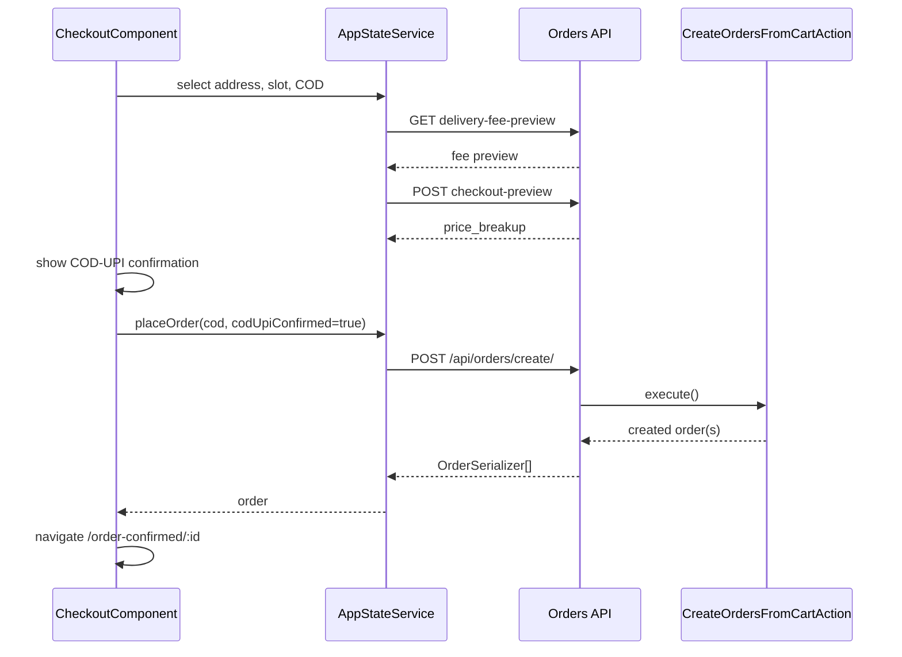
```mermaid
sequenceDiagram
  participant UI as CheckoutComponent
  participant State as AppStateService
  participant API as Orders API
  participant Action as CreateOrdersFromCartAction

  UI->>State: select address, slot, COD
  State->>API: GET delivery-fee-preview
  API-->>State: fee preview
  State->>API: POST checkout-preview
  API-->>State: price_breakup
  UI->>UI: show COD-UPI confirmation
  UI->>State: placeOrder(cod, codUpiConfirmed=true)
  State->>API: POST /api/orders/create/
  API->>Action: execute()
  Action-->>API: created order(s)
  API-->>State: OrderSerializer[]
  State-->>UI: order
  UI->>UI: navigate /order-confirmed/:id
```

### 9.10 Checkout Razorpay Flow

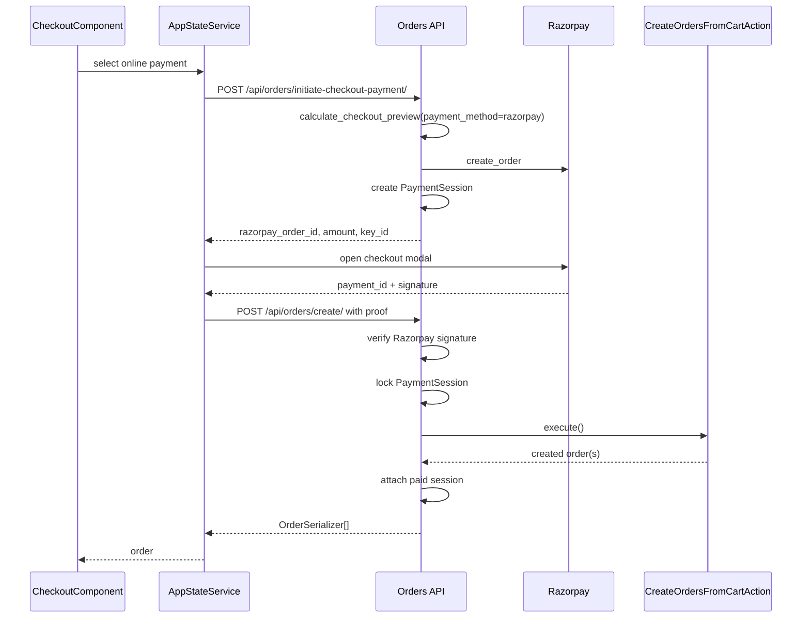
```mermaid
sequenceDiagram
  participant UI as CheckoutComponent
  participant State as AppStateService
  participant API as Orders API
  participant Razorpay as Razorpay
  participant Action as CreateOrdersFromCartAction

  UI->>State: select online payment
  State->>API: POST /api/orders/initiate-checkout-payment/
  API->>API: calculate_checkout_preview(payment_method=razorpay)
  API->>Razorpay: create_order
  API->>API: create PaymentSession
  API-->>State: razorpay_order_id, amount, key_id
  State->>Razorpay: open checkout modal
  Razorpay-->>State: payment_id + signature
  State->>API: POST /api/orders/create/ with proof
  API->>API: verify Razorpay signature
  API->>API: lock PaymentSession
  API->>Action: execute()
  Action-->>API: created order(s)
  API->>API: attach paid session
  API-->>State: OrderSerializer[]
  State-->>UI: order
```

### 9.11 Scheduled Order Flow

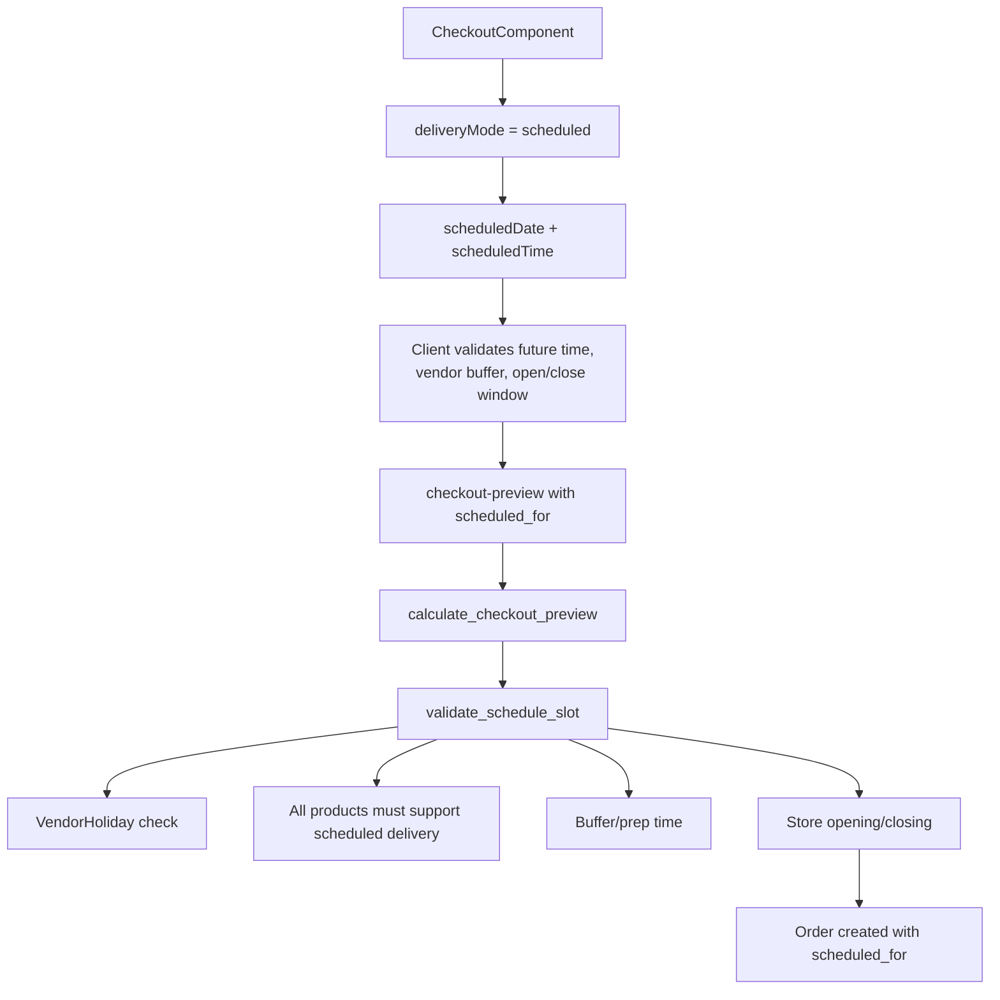
```mermaid
flowchart TD
  Checkout["CheckoutComponent"] --> Mode["deliveryMode = scheduled"]
  Mode --> DateTime["scheduledDate + scheduledTime"]
  DateTime --> LocalValidation["Client validates future time,<br/>vendor buffer, open/close window"]
  LocalValidation --> Preview["checkout-preview with scheduled_for"]
  Preview --> Backend["calculate_checkout_preview"]
  Backend --> ScheduleRules["validate_schedule_slot"]
  ScheduleRules --> Holiday["VendorHoliday check"]
  ScheduleRules --> ProductFlag["All products must support scheduled delivery"]
  ScheduleRules --> MinPrep["Buffer/prep time"]
  ScheduleRules --> Window["Store opening/closing"]
  Window --> Order["Order created with scheduled_for"]
```

### 9.12 Order Confirmation and Active Order Flow

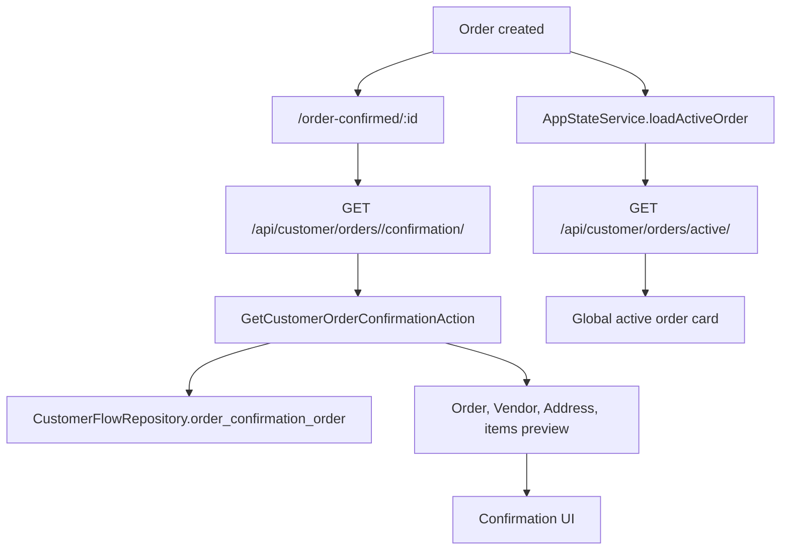
```mermaid
flowchart TD
  CreateOrder["Order created"] --> ConfirmPage["/order-confirmed/:id"]
  ConfirmPage --> API["GET /api/customer/orders/<id>/confirmation/"]
  API --> Action["GetCustomerOrderConfirmationAction"]
  Action --> Repo["CustomerFlowRepository.order_confirmation_order"]
  Action --> Serializer["Order, Vendor, Address, items preview"]
  Serializer --> UI["Confirmation UI"]
  CreateOrder --> Active["AppStateService.loadActiveOrder"]
  Active --> ActiveAPI["GET /api/customer/orders/active/"]
  ActiveAPI --> Card["Global active order card"]
```

### 9.13 Tracking Flow

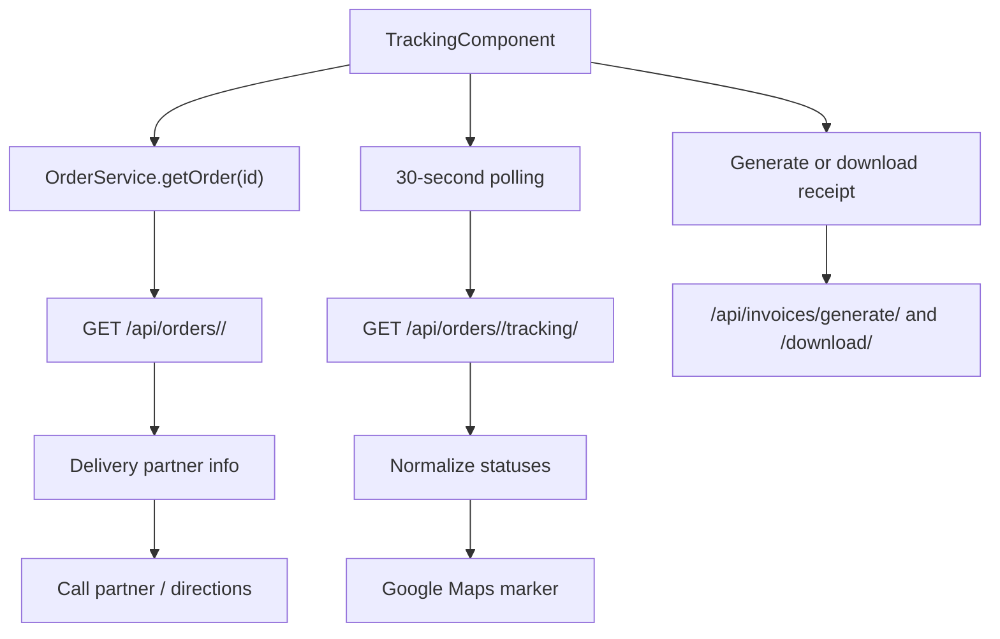
```mermaid
flowchart TD
  Tracking["TrackingComponent"] --> Order["OrderService.getOrder(id)"]
  Order --> DetailAPI["GET /api/orders/<id>/"]
  Tracking --> Poll["30-second polling"]
  Poll --> TrackingAPI["GET /api/orders/<id>/tracking/"]
  TrackingAPI --> Timeline["Normalize statuses"]
  DetailAPI --> Partner["Delivery partner info"]
  Timeline --> Map["Google Maps marker"]
  Partner --> Actions["Call partner / directions"]
  Tracking --> Receipt["Generate or download receipt"]
  Receipt --> InvoiceAPI["/api/invoices/generate/ and /download/"]
```

### 9.14 Rating and Finished Order Flow

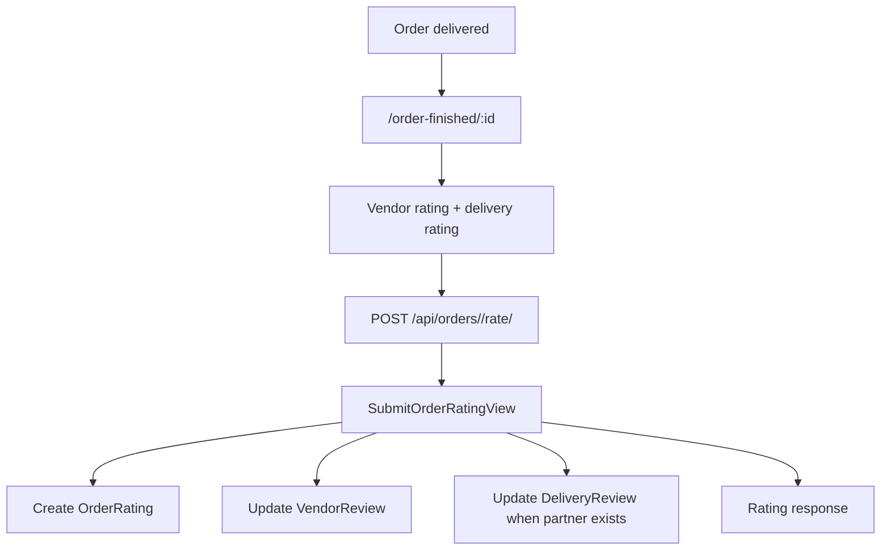
```mermaid
flowchart TD
  Delivered["Order delivered"] --> Finished["/order-finished/:id"]
  Finished --> Ratings["Vendor rating + delivery rating"]
  Ratings --> API["POST /api/orders/<id>/rate/"]
  API --> View["SubmitOrderRatingView"]
  View --> OrderRating["Create OrderRating"]
  View --> VendorReview["Update VendorReview"]
  View --> DeliveryReview["Update DeliveryReview when partner exists"]
  View --> Response["Rating response"]
```

### 9.15 Notifications Flow

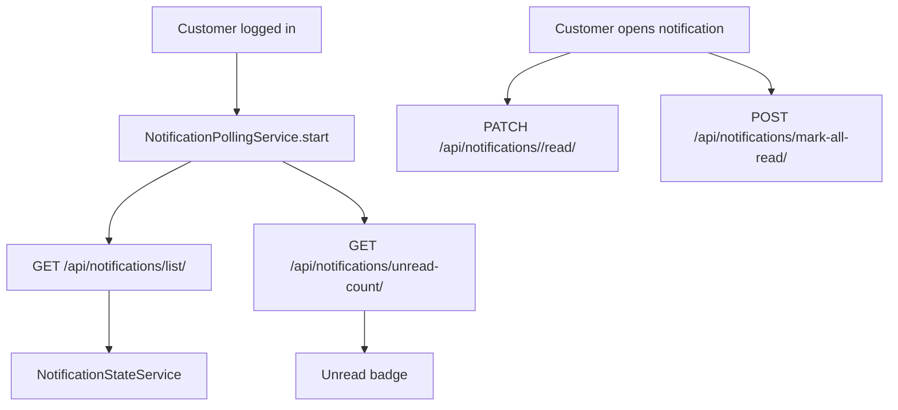
```mermaid
flowchart TD
  Login["Customer logged in"] --> Polling["NotificationPollingService.start"]
  Polling --> List["GET /api/notifications/list/"]
  Polling --> Count["GET /api/notifications/unread-count/"]
  List --> State["NotificationStateService"]
  Count --> Badge["Unread badge"]
  User["Customer opens notification"] --> Read["PATCH /api/notifications/<id>/read/"]
  User --> MarkAll["POST /api/notifications/mark-all-read/"]
```

### 9.16 Account and Address Flow

```mermaid
flowchart TD
  Account["Account/Profile"] --> Profile["GET/PUT /api/auth/profile/"]
  Account --> Addresses["/addresses"]
  Addresses --> List["GET /api/auth/addresses/"]
  Addresses --> Create["POST /api/auth/addresses/"]
  Addresses --> Update["PUT /api/auth/addresses/<id>/"]
  Addresses --> Delete["DELETE /api/auth/addresses/<id>/"]
  Addresses --> Select["AppStateService.selectAddress"]
  Select --> Location["Refresh location, catalog, serviceability,<br/>delivery fee preview"]
```

### 9.17 Support/Issue Flow

The customer app currently redirects issue/help routes back to account, but the API client and backend support order issues:

```mermaid
flowchart TD
  Order["Customer order"] --> IssueOptions["GET /api/orders/issues/options/"]
  Order --> CreateIssue["POST /api/orders/issues/"]
  CreateIssue --> Issue["OrderIssue"]
  Issue --> Messages["POST /api/orders/issues/<id>/messages/"]
  Issue --> Attachments["POST /api/orders/issues/<id>/attachments/"]
  Issue --> WebSocket["ws/issues/<issue_id>/"]
```

## 10. Endpoint Map

### 10.1 Auth and Account

| Endpoint | Method | Purpose |
|---|---|---|
| `/api/auth/register/` | POST | Register customer |
| `/api/auth/login/` | POST | Password login |
| `/api/auth/mobile/request-login-otp/` | POST | Request login OTP |
| `/api/auth/mobile/verify-login-otp/` | POST | Verify login OTP |
| `/api/auth/mobile/request-register-otp/` | POST | Request registration OTP |
| `/api/auth/mobile/verify-register-otp/` | POST | Verify registration OTP |
| `/api/auth/refresh/` | POST | Refresh access token |
| `/api/auth/logout/` | POST | Logout and blacklist refresh |
| `/api/auth/profile/` | GET/PUT | Read/update profile |
| `/api/auth/addresses/` | CRUD | Saved address CRUD |
| `/api/auth/wallet/` | GET | Wallet summary |
| `/api/auth/loyalty/` | GET | Loyalty summary |
| `/api/auth/referral/` | GET | Referral summary |

### 10.2 Customer Composition

| Endpoint | Method | Purpose |
|---|---|---|
| `/api/customer/home/` | GET | Home composition |
| `/api/customer/location/serviceability/` | GET/POST | Serviceability |
| `/api/customer/explore/` | GET | Explore/search composition |
| `/api/customer/buy-again/` | GET | Buy-again products |
| `/api/customer/cart/suggestions/` | GET | Cart suggestions |
| `/api/customer/cart/apply-best-coupon/` | GET/POST | Best coupon |
| `/api/customer/checkout/slots/` | GET | Scheduled slots |
| `/api/customer/orders/active/` | GET | Active order summary |
| `/api/customer/orders/<uuid>/confirmation/` | GET | Order confirmation |

### 10.3 Catalog, Stores, Cart, Checkout, Orders

| Group | Endpoint | Purpose |
|---|---|---|
| Products | `/api/products/categories/` | Categories |
| Products | `/api/products/list/` | Product list |
| Products | `/api/products/<uuid>/` | Product detail |
| Products | `/api/products/search-by-location/` | Product search grouped by store/location |
| Products | `/api/products/wishlist/` | Wishlist |
| Vendors | `/api/vendors/list/` | Store discovery |
| Vendors | `/api/vendors/nearby/` | Nearby stores |
| Vendors | `/api/vendors/<uuid>/` | Store detail |
| Vendors | `/api/vendors/<uuid>/recommendations/` | Store recommendations |
| Cart | `/api/orders/cart/` | Get cart |
| Cart | `/api/orders/cart/add/` | Add item |
| Cart | `/api/orders/cart/replace/` | Replace cart |
| Cart | `/api/orders/cart/items/<uuid>/` | Update/remove item |
| Checkout | `/api/orders/delivery-fee-preview/` | Delivery fee preview |
| Checkout | `/api/orders/checkout-preview/` | Full checkout preview |
| Checkout | `/api/orders/available-slots/` | Scheduled slots |
| Checkout | `/api/orders/payment-methods/` | Enabled payment methods |
| Checkout | `/api/orders/initiate-checkout-payment/` | Razorpay checkout session |
| Orders | `/api/orders/create/` | Create order |
| Orders | `/api/orders/list/` | Order list |
| Orders | `/api/orders/<uuid>/` | Order detail |
| Orders | `/api/orders/<uuid>/tracking/` | Tracking |
| Orders | `/api/orders/<uuid>/cancel/` | Cancel order |
| Orders | `/api/orders/<uuid>/reorder/` | Reorder |
| Orders | `/api/orders/<uuid>/rate/` | Rating |

## 11. Backend Invariants

Backend source of truth rules:

- User must be authenticated for cart and checkout.
- Access token is short-lived; refresh token is rotated and stored in an HttpOnly cookie.
- Cart is one-store only.
- Product must be approved, active, available, and linked to a catalog product to be orderable.
- Product stock is checked before add/update and locked during order creation.
- Delivery address must belong to the customer.
- Delivery address must include receiver details, valid phone, valid pincode, latitude, and longitude.
- Store must be approved, open, and accepting orders.
- Store working hours and holidays are enforced.
- Scheduled orders require future slots, vendor schedule support, product scheduled-delivery support, and prep-time buffer.
- Store minimum order amount is enforced.
- Delivery serviceability is calculated from vendor/address/product/quantity/platform settings.
- Far delivery requires explicit confirmation.
- COD means UPI at delivery and requires explicit confirmation.
- Payment method must be enabled in platform settings.
- Razorpay payment proof must verify before order creation.
- Payment session is locked during order creation.
- Coupon validity, min amount, limits, and per-user usage are enforced.
- Wallet balance and loyalty balance are enforced.
- Pricing is calculated server-side.
- Order creation is transactionally safe.
- Inventory reservation and stock decrement are tied to order creation.
- Idempotency key can return existing orders.

## 12. Runtime Architecture

```mermaid
flowchart TB
  Browser["Customer Browser<br/>/sa/"] --> Proxy["Nginx / Reverse Proxy"]
  Proxy --> Static["Angular static assets<br/>dist/customer-app"]
  Proxy --> Django["Django API"]
  Django --> DB[("PostgreSQL")]
  Django --> Redis[("Redis")]
  Django --> Media["Local/S3 Media"]
  Django --> Razorpay["Razorpay"]
  Django --> Reco["Recommendation Service"]
  Django --> FCM["Firebase / FCM"]
  Redis --> Worker["RQ Worker"]
  Redis --> Scheduler["RQ Scheduler"]
  Redis --> Channels["Django Channels"]
  Browser -.WebSocket.-> Channels
```

Runtime components:

| Component | Purpose |
|---|---|
| Angular customer-app | Customer browser/mobile UI |
| Django API | REST and WebSocket application |
| PostgreSQL | Primary database |
| Redis cache | API and Django cache |
| Redis RQ | Background job queue |
| RQ worker | Async jobs |
| RQ scheduler | Recurring/deferred jobs |
| Channels | WebSocket layer |
| Razorpay | Online payments |
| Firebase/FCM | Push notifications |
| S3/local storage | Media and PDFs |
| Recommendation service | Optional ML ranking |

## 13. Source File Map

### 13.1 Frontend

| Area | File |
|---|---|
| Bootstrap | `frontend/projects/customer-app/src/main.ts` |
| Routes | `frontend/projects/customer-app/src/app/app.routes.ts` |
| App shell | `frontend/projects/customer-app/src/app/app.component.ts` |
| Models | `frontend/projects/customer-app/src/app/models.ts` |
| Main state | `frontend/projects/customer-app/src/app/services/app-state.service.ts` |
| Catalog state | `frontend/projects/customer-app/src/app/services/catalog.service.ts` |
| Order state | `frontend/projects/customer-app/src/app/services/order.service.ts` |
| UI state | `frontend/projects/customer-app/src/app/services/ui.service.ts` |
| Customer auth wrapper | `frontend/projects/customer-app/src/app/services/auth.service.ts` |
| API client bridge | `frontend/projects/customer-app/src/app/services/customer-api-client.service.ts` |
| Account API wrapper | `frontend/projects/customer-app/src/app/services/customer-account-api.service.ts` |
| Cart API wrapper | `frontend/projects/customer-app/src/app/services/customer-cart-api.service.ts` |
| Catalog API wrapper | `frontend/projects/customer-app/src/app/services/customer-catalog-api.service.ts` |
| Order API wrapper | `frontend/projects/customer-app/src/app/services/customer-order-api.service.ts` |
| Home page | `frontend/projects/customer-app/src/app/pages/home/home.component.ts` |
| Explore page | `frontend/projects/customer-app/src/app/pages/search/search.component.ts` |
| Checkout page | `frontend/projects/customer-app/src/app/pages/checkout/checkout.component.ts` |
| Tracking page | `frontend/projects/customer-app/src/app/pages/tracking/tracking.component.ts` |
| API package | `packages/customer-api-client/src/index.ts` |

### 13.2 Backend

| Area | File |
|---|---|
| Root routes | `backend/backend/routes/__init__.py` |
| Customer routes | `backend/backend/routes/customer.py` |
| Customer views | `backend/backend/views/customer_views.py` |
| Home action | `backend/backend/actions/customer_flow/home.py` |
| Explore action | `backend/backend/actions/customer_flow/explore.py` |
| Location mixin | `backend/backend/actions/customer_flow/location.py` |
| Customer order actions | `backend/backend/actions/customer_flow/orders.py` |
| Personalization | `backend/backend/actions/customer_flow/personalization.py` |
| Coupon composition | `backend/backend/actions/customer_flow/coupons.py` |
| Customer repository | `backend/backend/data/customer_flow_repository.py` |
| Recommendation client | `backend/backend/services/recommendations.py` |
| Auth views | `backend/accounts/views/auth_views.py` |
| Address views | `backend/accounts/views/address_views.py` |
| Product list/detail | `backend/products/views/inventory.py` |
| Product search | `backend/products/views/search_views.py` |
| Wishlist views | `backend/products/views/wishlist_views.py` |
| Store discovery | `backend/vendors/views/discovery_views.py` |
| Store detail | `backend/vendors/views/detail_public_views.py` |
| Store recommendations | `backend/vendors/views/recommendation_views.py` |
| Cart views | `backend/orders/views/cart_views.py` |
| Checkout preview | `backend/orders/views/checkout_preview_views.py` |
| Create order view | `backend/orders/views/create_order_views.py` |
| Payment views | `backend/orders/views/payment_views.py` |
| Order read/tracking | `backend/orders/views/order_read_views.py` |
| Checkout logic | `backend/orders/actions/checkout.py` |
| Order creation action | `backend/orders/actions/ordering/create_orders.py` |
| ASGI/WebSockets | `backend/backend/config/asgi.py` |

## 14. Implementation Observations

1. The customer app has a real frontend domain layer. `AppStateService`, `CatalogService`, and `OrderService` coordinate most customer workflows.
2. The customer API client package is the cleanest API boundary. New customer APIs should be added there first, then wrapped by Angular API services when Observables are needed.
3. `/api/customer/*` should remain screen-composition focused. Writes should stay in canonical domain APIs.
4. Checkout must remain backend-authoritative.
5. Customer tracking has WebSocket infrastructure available but currently uses REST polling.
6. Recommendation service integration is optional and fail-soft.
7. Redis is a shared runtime dependency for cache, queue, scheduler, and WebSockets.
8. The repository instructions mention Angular 19, but the current `frontend/package.json` uses Angular 21.x. Treat package metadata as the implementation source of truth unless the project intentionally downgrades.

## 15. Recommended Next Documents

- Checkout/order creation LLD with database field-level details.
- Customer composition API request/response examples.
- WebSocket migration design for customer tracking.
- Guest cart and cart conflict sequence details.
- Customer page-level component inventory and visual state map.

