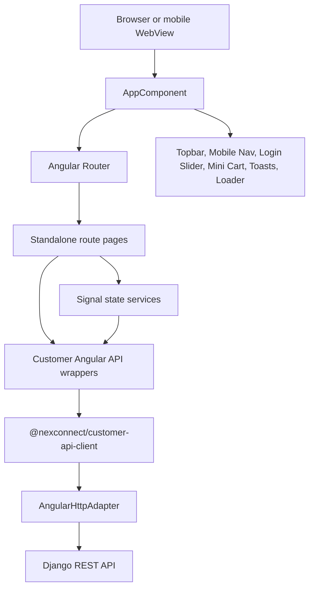
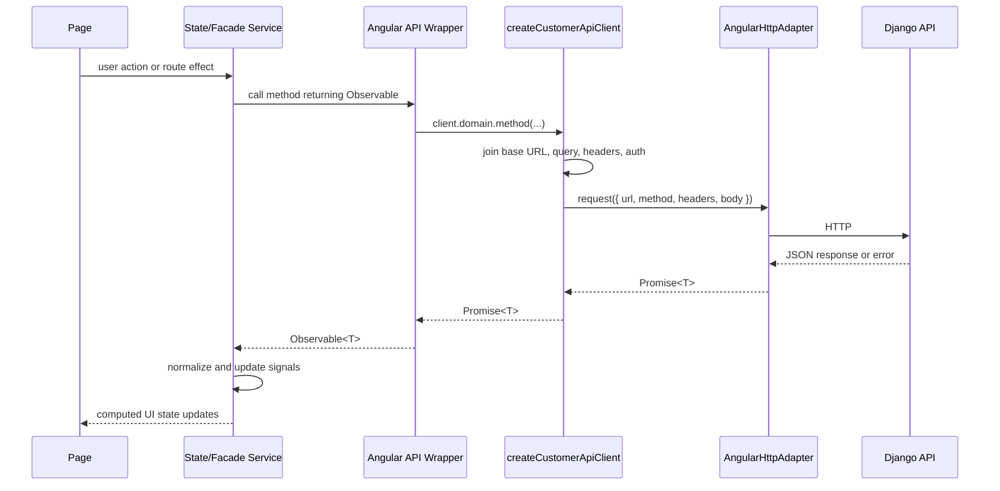
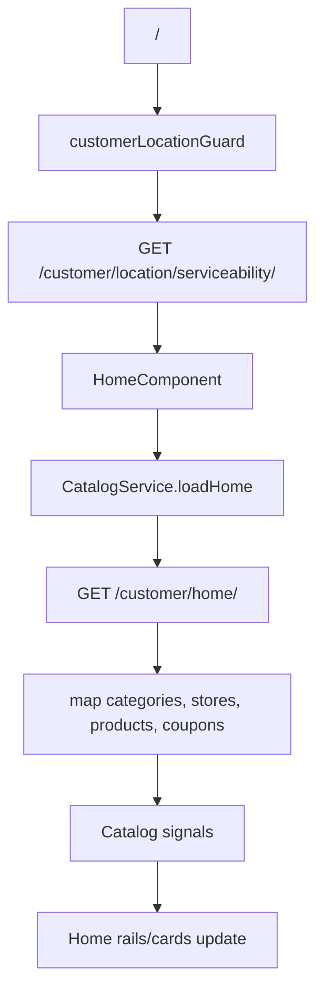
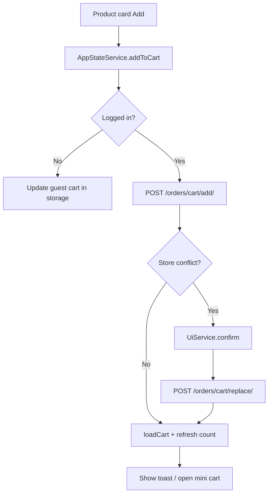
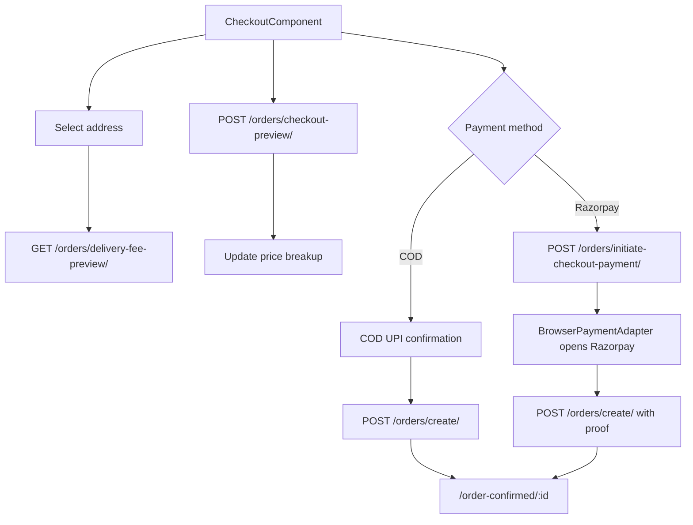
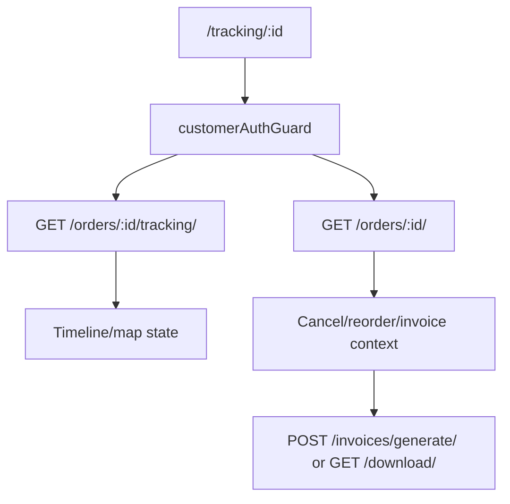

# Nextou Customer App Complete Report

Generated from the repository on 2026-06-30.

## 1. Scope

This report covers the Angular customer application at `frontend/projects/customer-app`, the shared frontend library APIs it uses, and the customer-specific reusable packages under `packages/customer-*` where they are visible from the app code.

The report includes:

- App architecture and design patterns
- Complete route and component inventory
- Color palette and design-token usage
- Feature map by page
- Request and response pattern
- API calls made by the customer app
- Core data models
- Mobile and responsive behavior
- Implementation notes and risks

## 2. Executive Summary

The customer app is a standalone Angular application that implements the end-customer shopping journey for Nextou. It is structured as route-loaded standalone page components, global shell components, mobile-specific UI primitives, local state/facade services, and shared API infrastructure.

The most important client-side services are:

| Service | Role |
|---|---|
| `AppStateService` | Owns cart, checkout, address, location, payment, serviceability, and active order state. |
| `CatalogService` | Owns categories, stores, products, home composition, explore/search, banners, coupons, and vendor/product caches. |
| `OrderService` | Owns order list, order cache, reorder, cancel, and rating flows. |
| `UiService` | Owns login slider, mini cart, filter slider, location modal, edit modal, menus, and confirm dialog state. |
| `AuthService` | Customer-facing auth wrapper around the shared auth service. |
| `CustomerApiClientService` | Bridges Angular to `@nexconnect/customer-api-client`. |

Primary app pattern:



## 3. Runtime and Build

| Area | Current implementation |
|---|---|
| Main entry | `frontend/projects/customer-app/src/main.ts` |
| Root component | `frontend/projects/customer-app/src/app/app.component.ts` |
| Routes | `frontend/projects/customer-app/src/app/app.routes.ts` |
| Styles | `frontend/projects/customer-app/src/styles.scss` |
| Development API base | `/api` |
| Production API base | `/sa/api` |
| Mobile API base | `https://nex-connect.in/sa/api` |
| Auth prefix | `customer` |
| HTTP interceptors | Shared `authInterceptor`, `cacheInterceptor` |
| Route scroll behavior | `withInMemoryScrolling({ scrollPositionRestoration: 'top' })` |

Version note:

- The root `frontend/package.json` uses Angular `^21.2.x`.
- The nested `frontend/projects/customer-app/package.json` uses Angular `^18.2.x`.
- The repository instructions mention Angular 19. Treat the root frontend package as the active monorepo source of truth unless the team intentionally runs the nested app package separately.

## 4. Architecture

### 4.1 Layers

| Layer | Files | Responsibility |
|---|---|---|
| Bootstrap | `src/main.ts` | Registers router, HTTP, API base URL, auth prefix, animations, Google Maps runtime config. |
| App shell | `src/app/app.component.*` | Hosts topbar, mobile topbar, router outlet, global overlays, loaders, mobile bottom nav, sticky cart, active order card. |
| Route pages | `src/app/pages/**` | Screen-level views such as home, explore, store detail, product detail, cart, checkout, orders, tracking, profile. |
| Reusable app components | `src/app/components/**` | Product cards, store cards, order summary, right rail. |
| Mobile UI primitives | `src/app/mobile-ui/**` | Compact mobile cards, shell, bottom nav, topbar, steppers, sheets, search, product rows. |
| Shared local UI | `src/app/shared/**` | Login slider, mini cart, modals, topbar, footer, breadcrumbs, filter slider, base UI atoms. |
| Customer state/services | `src/app/services/**` | Signals, facades, API wrappers, guards, startup, visual/content config. |
| Shared library | `frontend/projects/shared/src/lib/**` | Cross-app auth, API, interceptors, models, toast, loading, location, notifications. |
| Packages | `packages/customer-*` | Domain utilities for customer core, location, cart, checkout, orders, pricing, search, errors, API client. |

### 4.2 Design Patterns

| Pattern | How it is used |
|---|---|
| Standalone components | Every page/component is standalone. Routes lazy-load components with `loadComponent`. |
| Signals first state | Local app state uses `signal`, `computed`, and `effect` rather than NgRx. |
| Service orchestration | Pages stay UI-oriented. Business workflows sit in services such as `AppStateService`, `CatalogService`, and `OrderService`. |
| API wrapper pattern | Angular services wrap the promise-based customer API client into RxJS Observables. |
| Adapter pattern | `AngularHttpAdapter`, `BrowserTokenStorageAdapter`, and `BrowserPaymentAdapter` adapt browser/Angular APIs to package interfaces. |
| Response normalization | Catalog/order/cart responses are normalized into app models before reaching cards and pages. |
| Mobile bifurcation | Desktop and mobile views coexist through CSS visibility and dedicated mobile primitives. |
| Guarded route flow | Location guard enforces serviceability before commerce routes. Auth guard opens login and redirects for protected order flows. |

## 5. Route Map

| Route | Component | Guard | Purpose |
|---|---|---|---|
| `/feature-unavailable` | Shared `PageFeatureUnavailableComponent` | None | Feature-gated fallback page. |
| `/location` | `LocationComponent` | None | Select current/manual/saved delivery location. |
| `/` | `HomeComponent` | `customerLocationGuard` | Home commerce surface. |
| `/new-home` | Redirect to `/` | None | Legacy alias. |
| `/categories` | Redirect to `/explore` | None | Legacy alias. |
| `/explore` | `SearchComponent` | `customerLocationGuard` | Browse/search products, stores, categories, offers. |
| `/explore/:categoryId` | `SearchComponent` | `customerLocationGuard` | Category-scoped explore. |
| `/stores` | Redirect to `/explore` | None | Legacy alias. |
| `/category/:id` | Redirect to `/explore/:id` | None | Legacy alias. |
| `/store/:id` | `StoreDetailComponent` | `customerLocationGuard` | Store detail and store products. |
| `/product/:id` | `ProductDetailComponent` | `customerLocationGuard` | Product detail and add-to-cart. |
| `/search` | Redirect to `/explore` | None | Legacy alias. |
| `/cart` | `CartComponent` | `customerLocationGuard` | Cart review, coupon, checkout entry. |
| `/checkout` | `CheckoutComponent` | `customerLocationGuard` | Address, schedule, payment, order placement. |
| `/orders` | `OrdersComponent` | None | Order history. |
| `/order-confirmed/:id` | `OrderConfirmedComponent` | `customerAuthGuard` | Post-order confirmation. |
| `/tracking/:id` | `TrackingComponent` | `customerAuthGuard` | Tracking, timeline, invoice actions. |
| `/completed-order/:id` | Redirect to `/order-finished/:id` | None | Legacy alias. |
| `/order-finished/:id` | `OrderFinishedComponent` | `customerAuthGuard` | Delivered order completion and ratings. |
| `/order/:id` | Redirect to `/tracking/:id` | None | Legacy alias. |
| `/order/:id/tracking` | Redirect to `/tracking/:id` | None | Legacy alias. |
| `/order/:id/rating` | `OrderFinishedComponent` | `customerAuthGuard` | Rating page alias. |
| `/account` | `ProfileComponent` | None | Account hub. |
| `/profile` | Redirect to `/account` | None | Legacy alias. |
| `/addresses` | `AddressesComponent` | None | Saved address management. |
| `/notifications`, `/wishlist`, `/wallet`, `/payments`, `/help`, `/issues`, etc. | Redirects | None | Current placeholders redirect to account or explore. |
| `**` | Redirect to `/` | None | Fallback. |

## 6. Component Inventory

### 6.1 Root and Desktop Commerce Components

| Path | Selector | Class | Inputs | Outputs |
|---|---|---|---|---|
| `src/app/app.component.ts` | `fd-root` | `AppComponent` | | |
| `src/app/components/order-summary/order-summary.component.ts` | `fd-order-summary` | `OrderSummaryComponent` | `showButton` | |
| `src/app/components/product-card/product-card.component.ts` | `fd-product-card` | `ProductCardComponent` | `product`, `compact` | |
| `src/app/components/right-rail/right-rail.component.ts` | `fd-right-rail` | `RightRailComponent` | | |
| `src/app/components/store-card/store-card.component.ts` | `fd-store-card` | `StoreCardComponent` | `store` | |

### 6.2 Mobile UI Components

| Path | Selector | Class | Inputs | Outputs |
|---|---|---|---|---|
| `src/app/mobile-ui/mobile-bottom-nav/mobile-bottom-nav.component.ts` | `fd-mobile-bottom-nav` | `MobileBottomNavComponent` | | |
| `src/app/mobile-ui/mobile-bottom-sheet/mobile-bottom-sheet.component.ts` | `fd-mobile-bottom-sheet` | `MobileBottomSheetComponent` | `open`, `title` | `closed` |
| `src/app/mobile-ui/mobile-category-tabs/mobile-category-tabs.component.ts` | `fd-mobile-category-tabs` | `MobileCategoryTabsComponent` | `items`, `active` | `selected` |
| `src/app/mobile-ui/mobile-checkout-stepper/mobile-checkout-stepper.component.ts` | `fd-mobile-checkout-stepper` | `MobileCheckoutStepperComponent` | `active` | |
| `src/app/mobile-ui/mobile-empty-state/mobile-empty-state.component.ts` | `fd-mobile-empty-state` | `MobileEmptyStateComponent` | `icon`, `title`, `message`, `actionLabel`, `actionRoute` | |
| `src/app/mobile-ui/mobile-loader/mobile-loader.component.ts` | `fd-mobile-loader` | `MobileLoaderComponent` | `label` | |
| `src/app/mobile-ui/mobile-location-pill/mobile-location-pill.component.ts` | `fd-mobile-location-pill` | `MobileLocationPillComponent` | `label`, `subtitle` | `pressed` |
| `src/app/mobile-ui/mobile-page-header/mobile-page-header.component.ts` | `fd-mobile-page-header` | `MobilePageHeaderComponent` | `title`, `subtitle`, `icon`, `showBack` | |
| `src/app/mobile-ui/mobile-price-summary/mobile-price-summary.component.ts` | `fd-mobile-price-summary` | `MobilePriceSummaryComponent` | | |
| `src/app/mobile-ui/mobile-product-card/mobile-product-card.component.ts` | `fd-mobile-product-card` | `MobileProductCardComponent` | `product`, `layout` | |
| `src/app/mobile-ui/mobile-product-row/mobile-product-row.component.ts` | `fd-mobile-product-row` | `MobileProductRowComponent` | `image`, `name`, `subtitle`, `price`, `mrp`, `buttonLabel` | `pressed`, `add` |
| `src/app/mobile-ui/mobile-promo-card/mobile-promo-card.component.ts` | `fd-mobile-promo-card` | `MobilePromoCardComponent` | `eyebrow`, `title`, `subtitle`, `icon`, `image`, `cta`, `link` | |
| `src/app/mobile-ui/mobile-quantity-stepper/mobile-quantity-stepper.component.ts` | `fd-mobile-quantity-stepper` | `MobileQuantityStepperComponent` | `quantity` | `decrement`, `increment` |
| `src/app/mobile-ui/mobile-quick-action-grid/mobile-quick-action-grid.component.ts` | `fd-mobile-quick-action-grid` | `MobileQuickActionGridComponent` | `actions` | `selected` |
| `src/app/mobile-ui/mobile-search-bar/mobile-search-bar.component.ts` | `fd-mobile-search-bar` | `MobileSearchBarComponent` | `value`, `placeholder` | `valueChange`, `submitted` |
| `src/app/mobile-ui/mobile-shell/mobile-shell.component.ts` | `fd-mobile-shell` | `MobileShellComponent` | | |
| `src/app/mobile-ui/mobile-stepper/mobile-stepper.component.ts` | `fd-mobile-stepper` | `MobileStepperComponent` | `steps`, `active` | |
| `src/app/mobile-ui/mobile-store-card/mobile-store-card.component.ts` | `fd-mobile-store-card` | `MobileStoreCardComponent` | `store`, `compact` | |
| `src/app/mobile-ui/mobile-toast/mobile-toast.component.ts` | `fd-mobile-toast` | `MobileToastComponent` | `toast` | |
| `src/app/mobile-ui/mobile-topbar/mobile-topbar.component.ts` | `fd-mobile-topbar` | `MobileTopbarComponent` | | |

### 6.3 Route Page Components

| Path | Class | Primary responsibility |
|---|---|---|
| `src/app/pages/addresses/addresses.component.ts` | `AddressesComponent` | Saved address list, create, edit, delete, select/default. |
| `src/app/pages/cart/cart.component.ts` | `CartComponent` | Cart items, quantities, coupons, checkout blockers, totals. |
| `src/app/pages/categories/categories.component.ts` | `CategoriesComponent` | Legacy/category browse component. Route currently redirects to explore. |
| `src/app/pages/category/category.component.ts` | `CategoryComponent` | Legacy category detail component. Route currently redirects to explore. |
| `src/app/pages/category-redirect/category-redirect.component.ts` | `CategoryRedirectComponent` | Category redirect helper, currently not mounted directly in routes. |
| `src/app/pages/checkout/checkout.component.ts` | `CheckoutComponent` | Checkout steps, address, delivery mode, slots, payment, COD/Razorpay order creation. |
| `src/app/pages/home/home.component.ts` | `HomeComponent` | Home composition, hero, categories, stores, products, coupons, quick actions. |
| `src/app/pages/location/location.component.ts` | `LocationComponent` | Location permission/manual selection/serviceability entry. |
| `src/app/pages/notifications/notifications.component.ts` | `NotificationsComponent` | Notification list UI exists, but route currently redirects to account. |
| `src/app/pages/order-confirmed/order-confirmed.component.ts` | `OrderConfirmedComponent` | Confirmation payload, order summary, next actions. |
| `src/app/pages/order-finished/order-finished.component.ts` | `OrderFinishedComponent` | Delivered order completion, vendor/delivery ratings. |
| `src/app/pages/orders/orders.component.ts` | `OrdersComponent` | Order history, tabs/search, reorder/cancel actions. |
| `src/app/pages/product-detail/product-detail.component.ts` | `ProductDetailComponent` | Product detail, availability, similar products, add-to-cart. |
| `src/app/pages/profile/profile.component.ts` | `ProfileComponent` | Customer account hub, profile, order/account summaries. |
| `src/app/pages/search/search.component.ts` | `SearchComponent` | Explore/search, category browse, filters, tabs, server and local search. |
| `src/app/pages/store-detail/store-detail.component.ts` | `StoreDetailComponent` | Store hero/status, categories, store products, add-to-cart. |
| `src/app/pages/stores/stores.component.ts` | `StoresComponent` | Legacy store list component. Route currently redirects to explore. |
| `src/app/pages/tracking/tracking.component.ts` | `TrackingComponent` | Order status timeline, delivery partner info, map, invoice actions. |

### 6.4 Shared Local Components

| Path | Selector | Class | Inputs | Outputs |
|---|---|---|---|---|
| `src/app/shared/app-loader/app-loader.component.ts` | `fd-app-loader` | `AppLoaderComponent` | | |
| `src/app/shared/breadcrumbs/breadcrumbs.component.ts` | `fd-breadcrumbs` | `BreadcrumbsComponent` | `items` | |
| `src/app/shared/confirm-dialog/confirm-dialog.component.ts` | `fd-confirm-dialog` | `ConfirmDialogComponent` | | |
| `src/app/shared/customer-locked-state/customer-locked-state.component.ts` | `fd-customer-locked-state` | `CustomerLockedStateComponent` | `title`, `description`, `icon`, `actionLabel` | |
| `src/app/shared/edit-modal/edit-modal.component.ts` | `fd-edit-modal` | `EditModalComponent` | | |
| `src/app/shared/filter-slider/filter-slider.component.ts` | `fd-filter-slider` | `FilterSliderComponent` | | |
| `src/app/shared/footer/footer.component.ts` | `fd-footer` | `FooterComponent` | | |
| `src/app/shared/location-modal/location-modal.component.ts` | `fd-location-modal` | `LocationModalComponent` | | |
| `src/app/shared/login-slider/login-slider.component.ts` | `fd-login-slider` | `LoginSliderComponent` | | |
| `src/app/shared/mini-cart/mini-cart.component.ts` | `fd-mini-cart` | `MiniCartComponent` | | |
| `src/app/shared/mobile-bottom-nav/mobile-bottom-nav.component.ts` | `fd-mobile-bottom-nav` | `MobileBottomNavComponent` | | |
| `src/app/shared/mobile-sticky-cart-bar/mobile-sticky-cart-bar.component.ts` | `fd-mobile-sticky-cart-bar` | `MobileStickyCartBarComponent` | `visible` | |
| `src/app/shared/nextou-home/nextou-home.component.ts` | `nc-nextou-home` | `NextouHomeComponent` | | `storeSelected`, `productSelected`, `cartRequested`, `searchRequested`, `locationRequested` |
| `src/app/shared/sidebar/sidebar.component.ts` | `fd-sidebar` | `SidebarComponent` | | |
| `src/app/shared/topbar/topbar.component.ts` | `fd-topbar` | `TopbarComponent` | `homeMode` | |

### 6.5 UI Atoms

| Path | Selector | Class | Inputs | Outputs |
|---|---|---|---|---|
| `src/app/shared/ui/nx-button/nx-button.component.ts` | `fd-nx-button` | `NxButtonComponent` | `variant`, `color`, `full`, `disabled`, `type` | `clicked` |
| `src/app/shared/ui/nx-card/nx-card.component.ts` | `fd-nx-card` | `NxCardComponent` | `hover` | |
| `src/app/shared/ui/nx-input/nx-input.component.ts` | `fd-nx-input` | `NxInputComponent` | `label`, `value`, `placeholder`, `icon`, `type`, `clearable` | `valueChange` |
| `src/app/shared/ui/nx-modal-shell/nx-modal-shell.component.ts` | `fd-nx-modal-shell` | `NxModalShellComponent` | `open`, `title`, `subtitle`, `width` | `closed` |

Implementation note: there are two local components using selector `fd-mobile-bottom-nav`, one under `mobile-ui` and one under `shared`. The root shell imports the `mobile-ui` version. This duplicate selector is safe only if both are never imported into the same template compilation scope.

## 7. Feature Map

| Feature | Main page/components | Main services | Main APIs |
|---|---|---|---|
| Location gate | `LocationComponent`, `MobileLocationPillComponent`, location modal | `customerLocationGuard`, `LocationService`, `AppStateService`, `CustomerCatalogApiService` | `GET /customer/location/serviceability/` |
| Home | `HomeComponent`, product/store cards, promo cards, right rail | `CatalogService`, `AppStateService`, `CustomerContentConfigService` | `GET /customer/home/`, categories/products/vendors fallback APIs |
| Explore/search | `SearchComponent`, filter slider, category tabs, product/store cards | `CatalogService`, `UiService`, `AppStateService` | `GET /customer/explore/`, `GET /products/list/`, `GET /vendors/list/` |
| Store browsing | `StoreDetailComponent`, store cards, product cards | `CatalogService`, `AppStateService` | `GET /vendors/<id>/`, `GET /vendors/<id>/recommendations/` |
| Product details | `ProductDetailComponent`, product cards | `CatalogService`, `AppStateService` | `GET /products/<id>/`, add-to-cart APIs |
| Guest cart | Cart/mini-cart/product cards | `AppStateService`, local storage helpers from packages | Local storage until authenticated |
| Auth cart | `CartComponent`, `MiniCartComponent`, sticky cart | `AppStateService`, `CustomerCartApiService` | `GET /orders/cart/`, `POST /orders/cart/add/`, `PATCH/DELETE /orders/cart/items/<id>/` |
| Coupons | Cart and checkout | `AppStateService`, `CustomerCartApiService` | `GET /orders/coupons/`, `POST /orders/coupons/validate/`, `GET/POST /customer/cart/apply-best-coupon/` |
| Checkout preview | `CheckoutComponent`, price summary | `AppStateService`, `CustomerCartApiService` | `GET /orders/delivery-fee-preview/`, `POST /orders/checkout-preview/` |
| Slot scheduling | `CheckoutComponent`, steppers | `AppStateService`, `CustomerCartApiService` | `GET /customer/checkout/slots/`, `GET /orders/available-slots/` |
| Payment | `CheckoutComponent`, login slider | `AppStateService`, `BrowserPaymentAdapter` | `GET /orders/payment-methods/`, `POST /orders/initiate-checkout-payment/`, `POST /orders/create/` |
| Order history | `OrdersComponent` | `OrderService`, `CustomerOrderApiService` | `GET /orders/list/` |
| Order tracking | `TrackingComponent` | `OrderService`, `CustomerOrderApiService`, `GoogleMapsService` | `GET /orders/<id>/`, `GET /orders/<id>/tracking/` |
| Order confirmation | `OrderConfirmedComponent` | `CustomerApiClientService` | `GET /customer/orders/<id>/confirmation/` |
| Order finish/rating | `OrderFinishedComponent` | `OrderService` | `POST /orders/<id>/rate/` |
| Account/profile | `ProfileComponent`, edit modal | `AuthService`, `AppStateService`, `CustomerAccountApiService` | `GET/PUT /auth/profile/` |
| Address CRUD | `AddressesComponent`, edit modal, location modal | `AppStateService`, `CustomerAccountApiService` | `GET/POST /auth/addresses/`, `PUT/DELETE /auth/addresses/<id>/` |
| Notifications | Notification component, badges | `CustomerAppStartupService`, shared notification services | `GET /notifications/list/`, `GET /notifications/unread-count/`, read/mark-all APIs |
| Support/issues | Routes currently redirect, API client supports it | Customer API client support group | `/orders/issues/*` |
| Wallet/loyalty/referral | Routes currently redirect, API client supports it | Customer API client wallet group | `/auth/wallet/`, `/auth/loyalty/`, `/auth/referral/` |

## 8. Color Palettes and Design Tokens

The app uses several token layers. The effective customer app look is the final cascade from `styles.scss`, plus shared platform tokens.

### 8.1 Customer Quick-Commerce Tokens

Defined in `frontend/projects/customer-app/src/styles.scss`.

| Token | Value | Usage |
|---|---|---|
| `--cx-primary` | `#7c3aed` | Purple primary accent. |
| `--cx-primary-dark` | `#5b21b6` | Hover/strong purple. |
| `--cx-primary-soft` | `#ede9fe` | Soft purple surfaces. |
| `--cx-primary-ultra-soft` | `#f5f3ff` | Very soft purple controls. |
| `--cx-success`, `--cx-green` | `#16a34a` | Add buttons, checkout CTA, success. |
| `--cx-success-dark`, `--cx-green-dark` | `#15803d` | Active success states. |
| `--cx-success-soft`, `--cx-green-soft` | `#dcfce7` | Success badges. |
| `--cx-warning`, `--cx-orange` | `#f97316` | Deals, active chips, primary commerce CTA in some contexts. |
| `--cx-warning-dark`, `--cx-orange-dark` | `#ea580c` | Orange text/hover. |
| `--cx-warning-soft`, `--cx-orange-soft` | `#ffedd5` | Offer/warning background. |
| `--cx-yellow` | `#facc15` | Alternating card accents, pending badges. |
| `--cx-yellow-dark` | `#854d0e` | Yellow badge text. |
| `--cx-yellow-soft` | `#fef9c3` | Yellow badge background. |
| `--cx-danger`, `--cx-red` | `#dc2626` | Error/remove/cancel. |
| `--cx-danger-dark`, `--cx-red-dark` | `#b91c1c` | Strong error text. |
| `--cx-danger-soft`, `--cx-red-soft` | `#fee2e2` | Error badge background. |
| `--cx-bg` | `#f8fafc` | App page background. |
| `--cx-bg-warm` | `#faf7ff` | Warm alternate background. |
| `--cx-surface` | `#ffffff` | Card/surface background. |
| `--cx-surface-soft` | `#f9fafb` | Soft surface. |
| `--cx-border` | `#e5e7eb` | Standard border. |
| `--cx-border-soft` | `#f1f5f9` | Soft border. |
| `--cx-text` | `#111827` | Primary text. |
| `--cx-text-soft` | `#374151` | Secondary text. |
| `--cx-muted` | `#6b7280` | Muted text. |
| `--cx-muted-light` | `#9ca3af` | Light muted text. |

### 8.2 Nextou Brand Tokens

| Token | Value | Usage |
|---|---|---|
| `--nextou-primary-purple` | `#38268e` | Brand purple. |
| `--nextou-deep-purple` | `#23117c` | Deep brand purple. |
| `--nextou-secondary-purple` | `#6557a8` | Secondary purple/info. |
| `--nextou-accent-orange` | `#f97928` | Brand orange CTA/accent. |
| `--nextou-white` | `#fbfbfc` | White/off-white base. |
| `--nextou-bg` | `#f7f6fc` | Brand page background. |
| `--nextou-surface` | `#ffffff` | Brand card surface. |
| `--nextou-surface-soft` | `#fbfbfc` | Soft surface. |
| `--nextou-text` | `#111111` | Brand text. |
| `--nextou-text-strong` | `#050505` | Strong headings. |
| `--nextou-text-muted` | `#3f3f46` | Muted brand text. |
| `--nextou-text-soft` | `#6b7280` | Soft brand text. |
| `--nextou-border` | `#e8e5f4` | Brand border. |

### 8.3 Shared `fd-*` Semantic Tokens

| Token | Value or alias | Usage |
|---|---|---|
| `--fd-color-primary` | `var(--cx-primary)` in customer app, `#38268E` in shared platform | Primary semantic. |
| `--fd-color-primary-border` | `#ddd6fe` in customer app | Primary border. |
| `--fd-color-primary-soft` | `var(--cx-primary-soft)` | Primary soft background. |
| `--fd-color-success` | `var(--cx-success)` | Success. |
| `--fd-color-success-border` | `#bbf7d0` | Success border. |
| `--fd-color-success-soft` | `var(--cx-success-soft)` | Success background. |
| `--fd-color-warning` | `var(--cx-warning)` | Warning. |
| `--fd-color-warning-border` | `#fed7aa` | Warning border in customer app. |
| `--fd-color-warning-soft` | `var(--cx-warning-soft)` | Warning background. |
| `--fd-color-danger` | `var(--cx-danger)` | Danger. |
| `--fd-color-danger-border` | `#fecaca` | Danger border. |
| `--fd-color-danger-soft` | `var(--cx-danger-soft)` | Danger background. |
| `--fd-color-orange` | `var(--cx-warning)` | Orange. |
| `--fd-color-orange-border` | `#fed7aa` | Orange border. |
| `--fd-color-orange-soft` | `var(--cx-warning-soft)` | Orange background. |

### 8.4 Final Visual Redesign Tokens

Later in the cascade, the app defines a modern customer-app layer:

| Token | Value | Usage |
|---|---|---|
| `--nx-purple` | `#38268e` | Brand purple. |
| `--nx-purple-strong` | `#24106f` | Strong purple. |
| `--nx-orange` | `#f97928` | CTA/accent orange. |
| `--nx-yellow` | `#f8c21c` | Offer/alternate accent. |
| `--nx-green` | `#27ae60` | Success accent. |
| `--nx-red` | `#ef4444` | Error accent. |
| `--nx-ink` | `#11083f` | Strong page text. |
| `--nx-muted` | `#665f86` | Muted text. |
| `--nx-line` | `rgba(56, 38, 142, 0.14)` | Purple-tinted border. |
| `--nx-page` | `#f7f6fc` | Page background. |

### 8.5 Typography, Radius, and Layout Tokens

| Token group | Values |
|---|---|
| Font family | Customer app starts with Inter/system, final shared platform enforces Nunito through `--nc-font-family`. |
| Font scale | `--cx-font-xs: 11px`, `--cx-font-sm: 12px`, `--cx-font-md: 14px`, `--cx-font-base: 16px`, `--cx-font-lg: 18px`, `--cx-font-xl: 20px`, `--cx-font-2xl: 24px`, `--cx-font-3xl: 30px`. |
| Spacing | `--cx-space-1` through `--cx-space-12`, from `4px` to `48px`. |
| Radii | `--cx-radius-xs: 6px`, `--cx-radius-sm: 8px`, `--cx-radius-md: 12px`, `--cx-radius-lg: 16px`, `--cx-radius-xl: 20px`, `--cx-radius-2xl: 24px`, `--cx-radius-pill: 999px`. |
| Final card radius | `--cx-consistent-card-radius: 8px`. |
| Final control radius | `--cx-consistent-control-radius: 12px`. |
| Page max width | `--cx-page-max: 1180px`, later content max is about `1288px`. |
| Mobile shell | `--mobile-shell-max: 430px`. |
| Header/nav heights | `--customer-header-height: 78px`, `--cx-mobile-topbar-height: 64px`, `--cx-mobile-bottom-nav-height: 68px`, `--cx-sticky-cart-height: 64px`. |

### 8.6 Visual Rules Observed

- Add-to-cart and checkout CTAs are forced to green in the final cascade.
- Primary/general actions are orange or purple depending on selector order.
- Cards are eventually normalized to compact `8px` radius, white surfaces, and purple-tinted borders.
- Product/store/order/address cards receive alternating left accent bars: orange, yellow, green, red.
- Mobile surfaces use a max-width shell around `430px` with dense product grids.
- Material Symbols Rounded and Material Icons Outlined are locally loaded from `/fonts` and `/sa/fonts`.

## 9. State and Service Architecture

### 9.1 `AppStateService`

Primary owner of cart, checkout, selected address, selected payment, coupon, location, serviceability, and active order.

Key signals/computed values:

| State | Purpose |
|---|---|
| `location` | Display location label. |
| `cart` | Current backend or guest cart. |
| `addresses` | Saved customer addresses. |
| `paymentMethods` | Enabled payment methods. |
| `activeAddress` | Selected delivery address. |
| `selectedPaymentMethod` | Selected checkout payment method. |
| `coupon`, `couponDiscount` | Applied coupon state. |
| `miniCartOpen` | Mini cart visibility. |
| `checkoutSubmitting`, `lastCheckoutError` | Checkout lifecycle. |
| `deliveryFeePreview`, `checkoutPriceBreakup` | Price preview data from backend. |
| `requiresFarDeliveryConfirmation` | Backend delivery quote requires explicit confirmation. |
| `serviceability`, `serviceabilityLoading` | Location serviceability. |
| `activeOrder` | Active order card payload. |
| `itemCount`, `subtotal`, `discount`, `deliveryFee`, `total` | Derived cart totals. |
| `cartCheckoutBlockReason`, `canCheckoutCart` | Checkout gating. |

Major workflows:

- Bootstrap authenticated state.
- Load/merge guest cart.
- Add/update/remove/clear cart items.
- Handle one-store cart conflict.
- Validate coupons.
- Select current/manual/saved location.
- Load, create, update, delete, and select addresses.
- Load payment methods.
- Check serviceability.
- Load active order.
- Create COD orders.
- Initiate Razorpay, open payment modal, verify proof, and create paid orders.
- Refresh checkout preview.

### 9.2 `CatalogService`

Owns read-heavy commerce data and normalizes backend records into customer app card models.

Owned state:

- Categories
- Stores
- Products
- Buy-again products
- Recommended products
- Products by store
- Banners
- Coupons
- Home hero
- Home sections
- Store pagination cursor
- Product and store request caches

Major workflows:

- `loadHome`
- `loadCategories`
- `loadStores`
- `loadMoreStores`
- `loadProducts`
- `loadExplore`
- `loadStoreProducts`
- `ensureProductLoaded`
- `ensureStoreProductsLoaded`
- `search`
- `refreshSearch`
- `mapProduct`, `mapStore`, `mapCategory`

### 9.3 `OrderService`

Owns customer order state and normalizes shared order responses.

Major workflows:

- Load orders on login.
- Clear orders on logout.
- Cache individual order detail responses.
- Place order through `AppStateService`.
- Reorder items into cart.
- Cancel order.
- Submit vendor/delivery rating.

### 9.4 `UiService`

Owns UI-only state:

- Login slider
- Mini cart
- Filter slider
- Location modal
- More/user menus
- Mobile sidebar
- Edit modal
- Confirm dialog
- Banner carousel index

### 9.5 Startup

`CustomerAppStartupService`:

- Loads customer content configuration.
- Loads feature access config.
- Starts feature polling for `customer-app`.
- Starts notification polling when logged in.
- Stops notification polling when logged out.
- Hides app loader and native splash screen after startup or timeout.

## 10. Request and Response Pattern

### 10.1 Transport Pattern

The customer app uses a package-first API client:



### 10.2 Request Shape

The package client builds requests with:

```ts
{
  url: joinUrl(apiBaseUrl, path, query),
  method: "GET" | "POST" | "PUT" | "PATCH" | "DELETE",
  headers: {
    Accept: "application/json",
    "Content-Type": "application/json",
    Authorization: "Bearer <access-token>"
  },
  body
}
```

Rules:

- `Content-Type` is omitted when body is `null`/`undefined` or `FormData`.
- Authenticated requests include `Authorization` if an access token exists.
- Public catalog requests explicitly pass `auth: false`.
- Query parameters are omitted when value is `undefined`, `null`, or empty string.
- On 401/auth errors, the client attempts one refresh using `/auth/refresh/`, stores the returned token, then retries once.
- If refresh fails, token storage is cleared.

### 10.3 Error Pattern

`CustomerApiError` carries:

| Field | Purpose |
|---|---|
| `message` | Human-readable error. |
| `status` | HTTP status if available. |
| `body` | Raw response body. |

Error messages are extracted from common backend shapes:

- `{ "error": "..." }`
- `{ "detail": "..." }`
- `{ "field": ["..."] }`
- raw string JSON
- native Error

Customer-facing errors are then mapped through `@nexconnect/customer-errors` and shared `apiErrorMessage`.

### 10.4 Response Shape Pattern

The app handles a mix of backend response shapes:

| Shape | Example | Handling |
|---|---|---|
| Direct object | `{ id, name, ... }` | Used directly or normalized into local model. |
| DRF paginated list | `{ count, next, previous, results: [...] }` | `listFromResponse` or manual extraction. |
| Plain list | `[...]` | Used directly. |
| Composition payload | `{ hero, categories, stores, products, sections, coupons }` | Split into CatalogService signals. |
| Checkout price payload | `{ price_breakup, delivery_fee, total, requires_confirmation }` | Stored in checkout preview signals. |
| Auth payload | `{ user, tokens }` or token fields | Shared auth service stores user/tokens. |

## 11. API Calls Used by Customer App

### 11.1 Auth and Account

| Method | Endpoint | Auth | Used for |
|---|---|---|---|
| `POST` | `/auth/login/` | No | Password login support in API client. |
| `POST` | `/auth/mobile/request-login-otp/` | No | Request customer login OTP. |
| `POST` | `/auth/mobile/verify-login-otp/` | No | Verify login OTP and receive tokens. |
| `POST` | `/auth/register/` | No | Registration support. |
| `POST` | `/auth/mobile/request-register-otp/` | No | Registration OTP support. |
| `POST` | `/auth/mobile/verify-register-otp/` | No | Verify registration OTP. |
| `POST` | `/auth/refresh/` | No | Refresh access token. |
| `POST` | `/auth/logout/` | Yes | Logout/refresh blacklist. |
| `GET` | `/auth/profile/` | Yes | Load profile. |
| `PUT` | `/auth/profile/` | Yes | Update profile/avatar. |
| `POST` | `/auth/password-reset/` | No | Password reset support. |
| `POST` | `/auth/password-reset/confirm/` | No | Password reset confirmation. |
| `GET` | `/auth/addresses/` | Yes | Address list. |
| `POST` | `/auth/addresses/` | Yes | Create address. |
| `PUT` | `/auth/addresses/<id>/` | Yes | Update address. |
| `DELETE` | `/auth/addresses/<id>/` | Yes | Delete address. |
| `GET` | `/auth/wallet/` | Yes | Wallet support. |
| `POST` | `/auth/wallet/topup/` | Yes | Wallet top-up support. |
| `POST` | `/auth/wallet/verify-topup/` | Yes | Wallet top-up verification. |
| `GET` | `/auth/loyalty/` | Yes | Loyalty summary. |
| `GET` | `/auth/loyalty/preview/` | Yes | Loyalty preview. |
| `GET` | `/auth/referral/` | Yes | Referral summary. |
| `POST` | `/auth/referral/apply/` | Yes | Apply referral. |
| `GET` | `/auth/referral/lookup/` | Yes | Lookup referral. |

### 11.2 Customer Composition

| Method | Endpoint | Auth | Used for |
|---|---|---|---|
| `GET` | `/customer/home/` | No | Home page composition. |
| `GET` | `/customer/location/serviceability/` | No | Location guard and serviceability display. |
| `GET` | `/customer/explore/` | No | Explore/search composition. |
| `GET` | `/customer/buy-again/` | Yes | Buy-again products. |
| `GET` | `/customer/cart/suggestions/` | Yes | Same-cart suggestions. |
| `GET` or `POST` | `/customer/cart/apply-best-coupon/` | Yes | Best coupon support. |
| `GET` | `/customer/checkout/slots/` | Yes | Customer checkout slot composition. |
| `GET` | `/customer/orders/active/` | Yes | Global active order card. |
| `GET` | `/customer/orders/<id>/confirmation/` | Yes | Order confirmation screen. |

### 11.3 Catalog and Discovery

| Method | Endpoint | Auth | Used for |
|---|---|---|---|
| `GET` | `/products/categories/` | No | Category list. |
| `GET` | `/products/list/` | No | Product list/filter/search. |
| `GET` | `/products/featured/` | No | Featured products. |
| `GET` | `/products/<id>/` | No | Product detail. |
| `GET` | `/products/<id>/reviews/` | No | Product reviews. |
| `GET` | `/products/search-by-location/` | No | Location-based product search. |
| `GET` | `/products/wishlist/` | Yes | Wishlist list. |
| `POST` | `/products/wishlist/<id>/toggle/` | Yes | Toggle wishlist. |
| `GET` | `/products/wishlist/status/` | Yes | Wishlist status for IDs. |
| `GET` | `/vendors/list/` | No | Store discovery and nearby/global search modes. |
| `GET` | `/vendors/<id>/` | No | Store detail. |
| `POST` | `/vendors/<id>/reviews/` | Yes | Vendor review. |
| `GET` | `/vendors/<id>/recommendations/` | Yes | Store recommendations. |
| `GET` | `/orders/banners/` | No | Banners. |
| `GET` | `/orders/coupons/` | No or Yes depending caller | Coupon list. |

### 11.4 Cart and Checkout

| Method | Endpoint | Auth | Used for |
|---|---|---|---|
| `GET` | `/orders/cart/` | Yes | Load cart. |
| `POST` | `/orders/cart/add/` | Yes | Add item. |
| `POST` | `/orders/cart/replace/` | Yes | Replace one-store cart on conflict. |
| `POST` | `/orders/cart/fulfillment/` | Yes | Refresh fulfillment lock/promise. |
| `POST` | `/orders/cart/fulfillment/events/` | Yes | Record fulfillment event. |
| `PATCH` | `/orders/cart/items/<id>/` | Yes | Update quantity. |
| `DELETE` | `/orders/cart/items/<id>/` | Yes | Remove item. |
| `DELETE` | `/orders/cart/clear/` | Yes | Clear cart. |
| `GET` | `/orders/delivery-fee-preview/` | Yes | Address-based delivery quote. |
| `POST` | `/orders/checkout-preview/` | Yes | Full backend price preview. |
| `GET` | `/orders/available-slots/` | Yes | Scheduled delivery slots. |
| `GET` | `/orders/payment-methods/` | Yes | Enabled payment methods. |
| `GET` | `/orders/cancellation-policy/` | Yes | Cancellation rules. |
| `POST` | `/orders/coupons/validate/` | Yes | Validate coupon. |
| `POST` | `/orders/initiate-checkout-payment/` | Yes | Razorpay checkout session. |
| `POST` | `/orders/create/` | Yes | Create COD or paid order. |
| `POST` | `/orders/<id>/create-payment/` | Yes | Legacy/order payment creation support. |
| `POST` | `/orders/<id>/verify-payment/` | Yes | Legacy/order payment verification support. |

### 11.5 Orders, Tracking, Notifications, Support, Invoices

| Method | Endpoint | Auth | Used for |
|---|---|---|---|
| `GET` | `/orders/list/` | Yes | Order history. |
| `GET` | `/orders/<id>/` | Yes | Order detail. |
| `GET` | `/orders/<id>/tracking/` | Yes | Tracking payload. |
| `POST` | `/orders/<id>/reorder/` | Yes | Reorder. |
| `POST` | `/orders/<id>/cancel/` | Yes | Cancel order. |
| `POST` | `/orders/<id>/rate/` | Yes | Vendor/delivery rating. |
| `POST` | `/orders/<id>/tip/` | Yes | Tip delivery partner support. |
| `GET` | `/notifications/list/` | Yes | Notification list. |
| `PATCH` | `/notifications/<id>/read/` | Yes | Mark notification read. |
| `POST` | `/notifications/mark-all-read/` | Yes | Mark all read. |
| `GET` | `/notifications/unread-count/` | Yes | Notification badge. |
| `POST` | `/notifications/device-token/` | Yes | Register push token. |
| `GET` | `/orders/issues/options/` | Yes | Issue options. |
| `GET` | `/orders/issues/` | Yes | Issue list. |
| `POST` | `/orders/issues/` | Yes | Create issue. |
| `GET` | `/orders/issues/<id>/` | Yes | Issue detail. |
| `POST` | `/orders/issues/<id>/messages/` | Yes | Send issue message. |
| `POST` | `/orders/issues/<id>/attachments/` | Yes | Attach issue file. |
| `POST` | `/invoices/generate/` | Yes | Generate invoice/receipt. |
| `GET` | `/invoices/<invoiceId>/download/` | Yes | Download invoice. |

## 12. Representative Request and Response Contracts

These examples reflect the frontend call shapes and expected fields used by the app. Backend may include additional fields.

### 12.1 Serviceability

Request:

```http
GET /api/customer/location/serviceability/?lat=12.9716&lng=77.5946&state=Karnataka&city=Bengaluru&postal_code=560001
```

Response used by app:

```json
{
  "is_serviceable": true,
  "message": "Delivery available",
  "nearby_store_count": 12,
  "instant_store_count": 4,
  "eta_label": "20-30 min",
  "nearest_store_eta": 24,
  "fulfillment_node": {
    "id": "uuid",
    "type": "vendor",
    "name": "Store name",
    "vendor_id": "uuid",
    "distance_km": 1.8,
    "is_instant": true,
    "is_accepting_orders": true
  },
  "promise": {
    "id": "promise-id",
    "fulfillment_node_id": "uuid",
    "eta_label": "20-30 min",
    "delivery_fee": "30.00",
    "distance_km": 1.8,
    "expires_at": "2026-06-30T12:00:00Z",
    "requires_confirmation": false
  }
}
```

### 12.2 Home Composition

Request:

```http
GET /api/customer/home/?lat=12.9716&lng=77.5946&city=Bengaluru&state=Karnataka
```

Response used by app:

```json
{
  "hero": {
    "title": "Fresh groceries delivered fast",
    "subtitle": "Shop nearby stores",
    "badge": "Instant delivery",
    "cta_label": "Explore",
    "cta_url": "/explore",
    "image": "https://..."
  },
  "categories": [],
  "stores": [],
  "products": [],
  "coupons": [],
  "banners": [],
  "sections": [
    {
      "key": "top_stores",
      "title": "Stores near you",
      "layout": "store_rail",
      "items": [],
      "count": 0
    }
  ]
}
```

### 12.3 Explore/Search

Request:

```http
GET /api/customer/explore/?q=milk&category=uuid&sort=relevance&lat=12.9716&lng=77.5946
```

Response used by app:

```json
{
  "categories": [],
  "products": [],
  "stores": [],
  "offers": [],
  "suggestions": [],
  "filters": {
    "sort": [],
    "categories": []
  },
  "summary": {
    "total_products": 18,
    "total_stores": 5
  }
}
```

### 12.4 Add to Cart

Request:

```http
POST /api/orders/cart/add/
Authorization: Bearer <token>
Content-Type: application/json

{
  "product_id": "uuid",
  "quantity": 2,
  "fulfillment_node_id": "uuid",
  "fulfillment_promise_id": "promise-id"
}
```

Success response used by app:

```json
{
  "id": "cart-id",
  "items": [
    {
      "id": "cart-item-id",
      "product": {
        "id": "product-id",
        "name": "Milk"
      },
      "quantity": 2,
      "subtotal": "120.00"
    }
  ],
  "total": "120.00"
}
```

Conflict response pattern:

```json
{
  "error": "Your cart already contains items from another store.",
  "code": "cart_store_conflict",
  "current_store": {
    "id": "uuid",
    "name": "Current Store"
  },
  "new_store": {
    "id": "uuid",
    "name": "New Store"
  }
}
```

The frontend shows a confirmation dialog and calls `/orders/cart/replace/` if the user agrees.

### 12.5 Checkout Preview

Request:

```http
POST /api/orders/checkout-preview/
Authorization: Bearer <token>
Content-Type: application/json

{
  "delivery_address_id": "uuid",
  "coupon_code": "SAVE10",
  "payment_method": "cod",
  "scheduled_for": null,
  "confirm_far_delivery": false
}
```

Response used by app:

```json
{
  "price_breakup": {
    "subtotal": "600.00",
    "discount": "60.00",
    "delivery_fee": "30.00",
    "platform_fee": "5.00",
    "handling_fee": "10.00",
    "small_cart_fee": "0.00",
    "tax_amount": "0.00",
    "surge_fee": "0.00",
    "total": "585.00"
  },
  "requires_far_delivery_confirmation": false,
  "delivery_promise": {
    "eta_label": "25-35 min"
  }
}
```

### 12.6 Initiate Razorpay Payment

Request:

```http
POST /api/orders/initiate-checkout-payment/
Authorization: Bearer <token>
Content-Type: application/json

{
  "delivery_address_id": "uuid",
  "coupon_code": "SAVE10",
  "wallet_amount": 0,
  "confirm_far_delivery": false,
  "scheduled_for": null
}
```

Response used by app:

```json
{
  "razorpay_order_id": "order_xxx",
  "amount": 58500,
  "currency": "INR",
  "key_id": "rzp_live_xxx",
  "payment_session_id": "uuid"
}
```

### 12.7 Create Order

Request:

```http
POST /api/orders/create/
Authorization: Bearer <token>
Content-Type: application/json

{
  "delivery_address_id": "uuid",
  "payment_method": "cod",
  "coupon_code": "SAVE10",
  "cod_upi_confirmed": true,
  "scheduled_for": null,
  "confirm_far_delivery": false,
  "idempotency_key": "client-generated-key"
}
```

Paid order request includes payment proof:

```json
{
  "delivery_address_id": "uuid",
  "payment_method": "razorpay",
  "payment_session_id": "uuid",
  "razorpay_order_id": "order_xxx",
  "razorpay_payment_id": "pay_xxx",
  "razorpay_signature": "signature"
}
```

Response used by app:

```json
[
  {
    "id": "order-id",
    "order_number": "NX-1001",
    "status": "pending",
    "payment_status": "pending",
    "total": "585.00",
    "items": []
  }
]
```

The frontend normalizes the first order and navigates to `/order-confirmed/:id`.

### 12.8 Tracking

Request:

```http
GET /api/orders/<id>/tracking/
Authorization: Bearer <token>
```

Response used by app:

```json
{
  "order_id": "uuid",
  "status": "out_for_delivery",
  "timeline": [
    {
      "status": "placed",
      "label": "Order placed",
      "timestamp": "2026-06-30T10:00:00Z"
    }
  ],
  "delivery_partner": {
    "name": "Partner Name",
    "phone": "+91..."
  },
  "location": {
    "lat": 12.9716,
    "lng": 77.5946
  }
}
```

## 13. Core App Models

Defined in `frontend/projects/customer-app/src/app/models.ts`.

| Model | Important fields |
|---|---|
| `Category` | `id`, `label`, `icon`, `image`, `bg`, `raw`. |
| `Store` | `id`, `name`, `category`, `rating`, `eta`, `distance`, `offer`, `delivery`, `image`, `hero`, `tags`, `isExpress`, `raw`. |
| `Product` | `id`, `apiId`, `cartItemId`, `name`, `unit`, `price`, `mrp`, `discount`, `image`, `category`, `rating`, `storeId`, `storeName`, `highlights`, `raw`. |
| `CartItem` | All `Product` fields plus `quantity`, `subtotal`, `rawCartItem`. |
| `Address` | `id`, `label`, `name`, `line`, `phone`, `isDefault`, `city`, `state`, `pincode`, `landmark`, `latitude`, `longitude`, `raw`. |
| `PaymentMethod` | `id`, `label`, `description`, `icon`, `isDefault`. |
| `Order` | `id`, `date`, `time`, `amount`, `items`, `status`, `payment`, `raw`. |
| `CustomerServiceability` | `is_serviceable`, `message`, store counts, `eta_label`, nearest store, fulfillment node, promise, availability summary. |
| `ActiveOrderSummary` | `id`, `order_number`, `status`, `payment_status`, `eta_label`, store, address, total, track/cancel flags. |
| `PlatformBanner` | `title`, `subtitle`, `badgeText`, `ctaLabel`, `ctaUrl`, `image`, gradient, raw. |
| `CustomerCoupon` | `code`, title/description, discount type/value, min order, badge/icon/accent, valid until. |
| `CustomerHomeHero` | Hero title, subtitle, badge, CTA, image, optional store/coupon. |
| `CustomerHomeSection` | `key`, `title`, `layout`, `items`, `count`. |
| `UserProfile` | `name`, `email`, `phone`, `memberSince`, `ordersDelivered`, `prime`. |

## 14. Guards and Access Behavior

### 14.1 `customerLocationGuard`

Behavior:

1. Reads location from shared `LocationService`.
2. Initializes location if needed.
3. Builds a customer location query using `@nexconnect/customer-location`.
4. If latitude/longitude are missing, redirects to `/location?returnUrl=<current>`.
5. Calls `/customer/location/serviceability/`.
6. Allows route only if `is_serviceable` is true.
7. On error, redirects to location.

### 14.2 `customerAuthGuard`

Behavior:

1. Allows if logged in and role is `customer`.
2. Clears session if another role is logged in.
3. Opens login slider.
4. Redirects checkout attempts to `/cart`; otherwise redirects to `/`.

## 15. Mobile Architecture

The customer app has a dedicated mobile layer rather than relying only on desktop CSS.

Key behaviors:

- At widths above `760px`, `.mobile-customer-view`, `.mobile-shell-only`, `fd-mobile-topbar`, and `fd-mobile-bottom-nav` are hidden.
- At widths at or below `760px`, `.desktop-shell-only` and desktop `fd-topbar` are hidden.
- Mobile pages use a constrained shell, usually `max-width: 430px`.
- Product grids switch to two columns on mobile.
- Sticky cart/CTA bars account for bottom nav height and safe-area insets.
- Mobile uses compact component primitives for product cards, store cards, promo cards, empty states, bottom sheets, steppers, and top/bottom nav.

## 16. Navigation Configuration

Customer navigation is split between route config and `src/app/config/customer-navigation.ts`. The content configuration service also exposes computed bottom nav, footer groups, home, ads, search tabs, filters, cart copy, and messages.

The route table is the source of truth for which pages are reachable. Several implemented pages are currently legacy or unreachable due to redirects.

## 17. Request Lifecycle by Major Flow

### 17.1 Home Load



### 17.2 Add to Cart



### 17.3 Checkout



### 17.4 Tracking



## 18. File Reference Map

| Concern | File |
|---|---|
| Bootstrap | `frontend/projects/customer-app/src/main.ts` |
| Routes | `frontend/projects/customer-app/src/app/app.routes.ts` |
| Root shell | `frontend/projects/customer-app/src/app/app.component.ts` |
| Global styles/tokens | `frontend/projects/customer-app/src/styles.scss` |
| Shared platform tokens | `frontend/projects/shared/src/styles/nextou-platform.css` |
| Local models | `frontend/projects/customer-app/src/app/models.ts` |
| App state | `frontend/projects/customer-app/src/app/services/app-state.service.ts` |
| Catalog state | `frontend/projects/customer-app/src/app/services/catalog.service.ts` |
| Order state | `frontend/projects/customer-app/src/app/services/order.service.ts` |
| UI state | `frontend/projects/customer-app/src/app/services/ui.service.ts` |
| Auth wrapper | `frontend/projects/customer-app/src/app/services/auth.service.ts` |
| API client bridge | `frontend/projects/customer-app/src/app/services/customer-api-client.service.ts` |
| Catalog API wrapper | `frontend/projects/customer-app/src/app/services/customer-catalog-api.service.ts` |
| Cart/checkout API wrapper | `frontend/projects/customer-app/src/app/services/customer-cart-api.service.ts` |
| Order API wrapper | `frontend/projects/customer-app/src/app/services/customer-order-api.service.ts` |
| Account API wrapper | `frontend/projects/customer-app/src/app/services/customer-account-api.service.ts` |
| API package | `packages/customer-api-client/src/index.ts` |
| Shared API service | `frontend/projects/shared/src/lib/services/api.service.ts` |
| Auth guard | `frontend/projects/customer-app/src/app/services/customer-auth.guard.ts` |
| Location guard | `frontend/projects/customer-app/src/app/services/customer-location.guard.ts` |
| Startup service | `frontend/projects/customer-app/src/app/services/customer-app-startup.service.ts` |

## 19. Implementation Notes

1. The app has a clear domain-service layer. New commerce behavior should generally be added to `AppStateService`, `CatalogService`, or `OrderService`, not directly inside page templates.
2. API additions should start in `packages/customer-api-client/src/index.ts`, then be wrapped by an Angular API service if the UI expects Observables.
3. The app uses both customer-specific API wrappers and the older shared `ApiService`. Prefer customer wrappers for customer-app flows to keep request handling consistent.
4. Public catalog APIs are called with `auth: false`, but authenticated users still get token behavior through other domains.
5. Backend pricing and checkout validation remain authoritative. Client totals are previews and display state.
6. Notification UI exists, but `/notifications` currently redirects to `/account`.
7. Wishlist, wallet, payment, referral, support, and issue APIs exist in the client, but many routes currently redirect to account or explore.
8. There is a duplicate local selector `fd-mobile-bottom-nav`. Avoid importing both implementations into one standalone component scope.
9. There is a version mismatch between repository instructions, nested customer package metadata, and root frontend metadata.
10. Production environment files include Google Maps API keys in source. Confirm this is intentional and restricted by domain/API policy.

## 20. Recommended Next Steps

| Priority | Recommendation |
|---|---|
| High | Decide whether `frontend/package.json` or `frontend/projects/customer-app/package.json` is the authoritative Angular version and clean up stale metadata. |
| High | Resolve or document the duplicate `fd-mobile-bottom-nav` selector. |
| Medium | Either mount the existing `NotificationsComponent` route or remove/defer it from the reportable active surface. |
| Medium | Add typed response interfaces for customer composition endpoints instead of `any` in API wrappers. |
| Medium | Add API contract examples to backend OpenAPI docs for `/customer/*` composition endpoints. |
| Low | Split `styles.scss` into token, base, desktop, mobile, and override layers to make cascade intent easier to maintain. |

